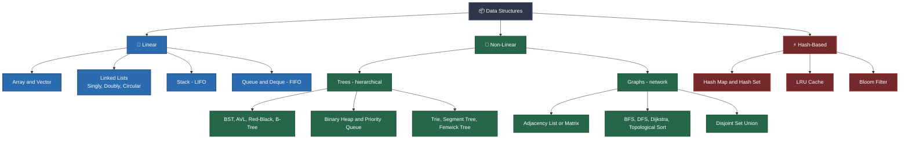
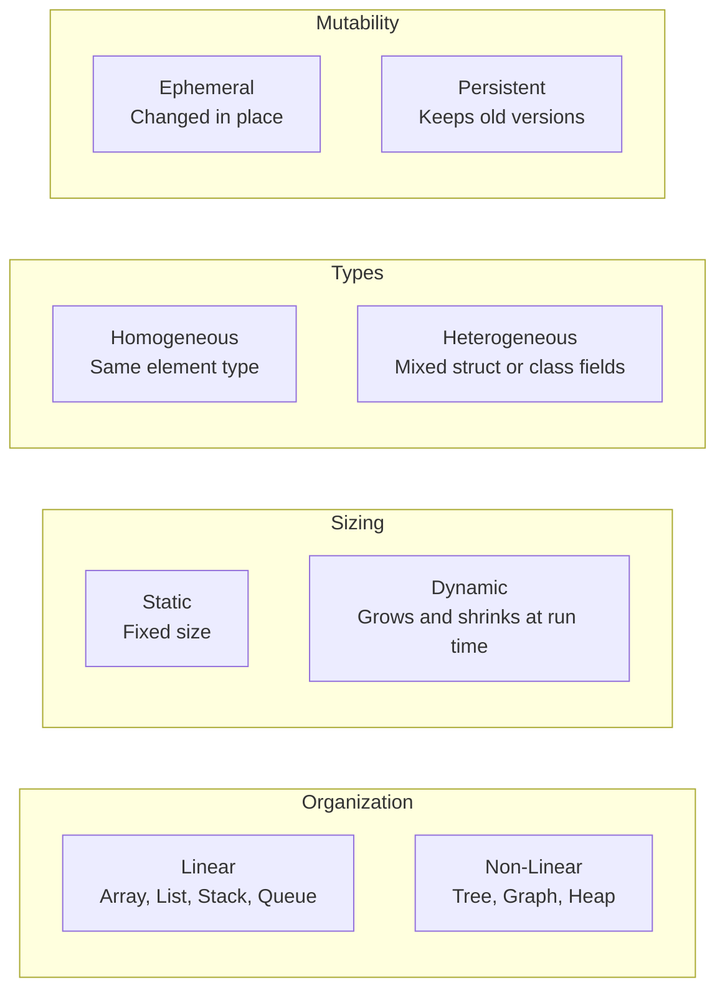
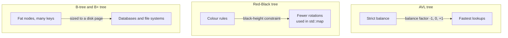
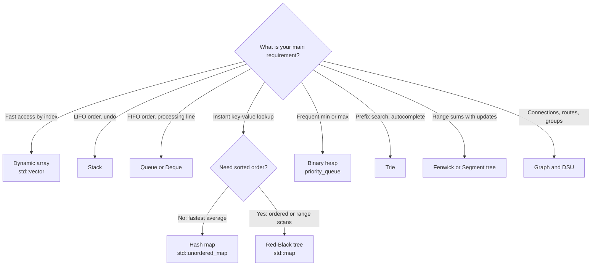

# 🚀 Data Structures: A Complete Visual Reference Guide
> **Concepts, categories, complexity tables and tested C++17 implementations**  
> *Clear theory • Visual diagrams • Time/space complexity • Code you can compile and run*

---

<div align="center">

[](https://isocpp.org/)
[](#p1)
[%20to%20O(n!)-brightgreen?style=for-the-badge)](#s8-1)
[](#build)
[](#layout)

<p align="center">
  <b>Learn every core data structure with intuitive mental models, ASCII and Mermaid diagrams, complexity tables, decision guides and working C++ code.</b>
</p>

[🧱 Fundamentals](#p1) •
[📏 Arrays](#p2) •
[🔗 Linked Lists](#p3) •
[🥞 Stacks & Queues](#p4) •
[⚡ Hash Tables](#p5) •
[🌳 Trees & Heaps](#p6) •
[🕸️ Graphs & DSU](#p7) •
[🧭 Cheatsheet](#p8)

</div>

---

## 🗺️ Visual Taxonomy of Data Structures



---

## 📚 Table of Contents

- [Part 1 - Fundamentals](#p1)
  - [1.1 What is a data structure?](#s1-1)
  - [1.2 Abstract data type (ADT) vs. data structure](#s1-2)
  - [1.3 Classification of data structures](#s1-3)
  - [1.4 Complexity analysis and Big-O](#s1-4)
  - [1.5 Memory basics (stack, heap, cache locality)](#s1-5)
- [Part 2 - Linear Structures: Arrays](#p2)
  - [2.1 Concept and address math](#s2-1)
  - [2.2 Variants of the array](#s2-2)
  - [2.3 Why doubling gives amortized O(1)](#s2-3)
  - [2.4 Implementation: dynamic array](#s2-4)
  - [2.5 Common array techniques](#s2-5)
- [Part 3 - Linear Structures: Linked Lists](#p3)
  - [3.1 Concept and node layout](#s3-1)
  - [3.2 Types of linked list](#s3-2)
  - [3.3 Array vs. linked list](#s3-3)
  - [3.4 Implementation: singly and doubly linked lists](#s3-4)
  - [3.5 Linked list techniques](#s3-5)
- [Part 4 - Linear Structures: Stack, Queue, Deque](#p4)
  - [4.1 Stack (LIFO)](#s4-1)
  - [4.2 Queue (FIFO) and the circular buffer](#s4-2)
  - [4.3 Deque](#s4-3)
  - [4.4 Implementation: stack, circular queue, bracket matching](#s4-4)
- [Part 5 - Hash-Based Structures](#p5)
  - [5.1 Hash table concept and hash functions](#s5-1)
  - [5.2 Collision handling](#s5-2)
  - [5.3 Load factor and rehashing](#s5-3)
  - [5.4 Implementation: hash table with chaining](#s5-4)
  - [5.5 Related structures](#s5-5)
  - [5.6 Case study: LRU cache](#s5-6)
- [Part 6 - Hierarchical Structures: Trees](#p6)
  - [6.1 Tree terminology](#s6-1)
  - [6.2 Binary trees and their shapes](#s6-2)
  - [6.3 Tree traversals](#s6-3)
  - [6.4 Binary search tree (BST)](#s6-4)
  - [6.5 Self-balancing trees (AVL, Red-Black, B-Tree)](#s6-5)
  - [6.6 Binary heap and priority queue](#s6-6)
  - [6.7 Trie (prefix tree)](#s6-7)
  - [6.8 Range-query trees: Segment tree and Fenwick tree](#s6-8)
- [Part 7 - Network Structures: Graphs](#p7)
  - [7.1 Graph terminology](#s7-1)
  - [7.2 Graph representations](#s7-2)
  - [7.3 Traversals and algorithms](#s7-3)
  - [7.4 Disjoint set union (union-find)](#s7-4)
- [Part 8 - Choosing the Right Structure](#p8)
  - [8.1 Master complexity cheatsheet](#s8-1)
  - [8.2 Decision flowchart](#s8-2)
  - [8.3 Common pitfalls](#s8-3)
  - [8.4 Study roadmap and practice problems](#s8-4)
- [Appendix - Sorting and searching at a glance](#appendix)
- [How to compile and run the code](#build)
- [Repository layout](#layout)

---

<a id="p1"></a>
# Part 1 - Fundamentals

> 💡 **Core idea:** a data structure is a way of organizing and storing data in memory so it can be accessed and modified efficiently.

<a id="s1-1"></a>
### 1.1 What is a data structure?

Every program handles data, but **how** that data is laid out in memory decides whether an operation takes a microsecond or never finishes.

A data structure has two inseparable sides:

1. **Data layout:** how the values are arranged in memory (one contiguous block, or scattered nodes joined by pointers).
2. **Operations and algorithms:** the rules to insert, delete, search, update and traverse the elements.

---

<a id="s1-2"></a>
### 1.2 Abstract data type (ADT) vs. data structure

An **ADT** describes *what* operations exist and how they behave. A **data structure** is a concrete *implementation* of an ADT.

| Concept | What is it? | Analogy | Examples |
| :--- | :--- | :--- | :--- |
| **Abstract data type** | The interface: behavior only, no memory details | Buttons on a TV remote | `List`, `Stack`, `Queue`, `PriorityQueue`, `Map`, `Set` |
| **Data structure** | The implementation: memory layout plus code | The circuits inside the remote | Dynamic array, singly linked list, binary heap, Red-Black tree |

| ADT | Core operations | Typical implementations |
| :--- | :--- | :--- |
| List | `get(i)`, insert, remove, size | Array, dynamic array, linked list |
| Stack | `push`, `pop`, `top`, `empty` | Array, linked list |
| Queue | `enqueue`, `dequeue`, `front` | Circular array, linked list |
| Deque | push/pop at both ends | Circular array, doubly linked list |
| Priority queue | insert, extract-min/max, peek | Binary heap, balanced BST |
| Map / dictionary | `put`, `get`, `erase` | Hash table, balanced BST |
| Set | insert, contains, erase | Hash set, balanced BST |
| Graph | add vertex/edge, neighbors | Adjacency list, adjacency matrix |

> [!TIP]
> **One ADT can have several implementations.** A `Queue` can be a **circular array** or a **doubly linked list**. Both give FIFO order, but they differ in cache locality and memory overhead.

---

<a id="s1-3"></a>
### 1.3 Classification of data structures

| Category | Structures | Defining trait |
| :--- | :--- | :--- |
| **Primitive** | `int`, `char`, `float`, `double`, `bool`, pointers | Built into the language; hold one value |
| **Linear - contiguous** | Array, dynamic array (vector), string | Elements side by side; O(1) index access |
| **Linear - linked** | Singly, doubly and circular linked lists | Scattered nodes joined by pointers |
| **Linear - restricted access** | Stack, queue, deque, priority queue | Insert/remove only at specific positions |
| **Hash-based** | Hash table, hash set, Bloom filter | A hash function maps a key straight to a location |
| **Hierarchical (trees)** | BST, AVL, Red-Black, heap, trie, segment tree, Fenwick tree, B-tree | One root, parent-child links, no cycles |
| **Network (graphs)** | Adjacency list/matrix, disjoint set union | Vertices joined by arbitrary edges; cycles allowed |



- **Linear vs. non-linear:** in a linear structure each element has at most one predecessor and one successor. Trees and graphs branch.
- **Static vs. dynamic:** `int a[100]` has a fixed capacity; `std::vector` and linked nodes grow on the heap.
- **Homogeneous vs. heterogeneous:** `std::vector<int>` holds one type; a `struct Student { std::string name; int id; };` mixes types.
- **Ephemeral vs. persistent:** persistent structures keep earlier versions after an update (common in functional programming and Git internals).

---

<a id="s1-4"></a>
### 1.4 Complexity analysis

We compare structures by how the number of steps (**time complexity**) and the memory used (**space complexity**) grow with the input size **n**. **Big-O notation** keeps only the fastest-growing term and drops constants: `3n + 10` is O(n) and `5n² + 100n` is O(n²).

```
Fastest  🟢  O(1)        Constant       array index, hash lookup (average)
         🟢  O(log n)    Logarithmic    binary search, balanced BST, heap push
         🟡  O(n)        Linear         scan an array, linked-list search
         🟡  O(n log n)  Linearithmic   merge sort, heap sort
         🔴  O(n²)       Quadratic      nested loops, bubble sort
         🔴  O(2ⁿ)       Exponential    subsets, naive Fibonacci
Slowest  💀  O(n!)       Factorial      all permutations
```

| Class | Steps for n = 1,000,000 |
| :--- | :--- |
| O(1) | 1 |
| O(log n) | about 20 |
| O(n) | 1,000,000 |
| O(n log n) | about 20,000,000 |
| O(n²) | 10¹² (too slow) |
| O(2ⁿ), O(n!) | infeasible |

#### Best, average and worst case

- **Best case:** the least work (linear search finds the target at index 0: O(1)).
- **Average case:** the expected work over typical inputs (quicksort: O(n log n)).
- **Worst case:** the guaranteed upper bound (quicksort with bad pivots: O(n²)). Unless stated otherwise, Big-O quotes the worst case.

#### Amortized analysis

When an operation is usually cheap but occasionally expensive, spread the expensive cost over many calls:

$$\text{Amortized cost} = \frac{\text{total cost of } n \text{ operations}}{n}$$

`std::vector::push_back` is O(n) only when it reallocates, which happens rarely, so it is **amortized O(1)**.

> [!IMPORTANT]
> **The 10⁸ rule of thumb.** A computer does roughly 10⁸ simple operations per second.
> - n up to 10⁵: O(n log n) or O(n) is comfortable.
> - n up to 10³ to 10⁴: O(n²) is usually acceptable.
> - n up to 20: exponential O(2ⁿ) or O(n!) can still work.

---

<a id="s1-5"></a>
### 1.5 Memory basics that every structure builds on

```
   CONTIGUOUS (array)                      LINKED (nodes)
  +----+----+----+----+----+             +----+     +----+     +----+
  | 10 | 20 | 30 | 40 | 50 |             | 10 | --> | 20 | --> | 30 |  ...
  +----+----+----+----+----+             +----+     +----+     +----+
  one block; neighbours share             each node allocated separately,
  a CPU cache line: fast scans            pointer chasing: cache misses
```

1. **Contiguous memory (arrays):** `address(a[i]) = base + i * sizeof(T)`, so indexing is O(1). Loading `a[0]` pulls a whole 64-byte cache line into the CPU cache, so sequential access is very fast (good **cache locality**).
2. **Linked memory (nodes and pointers):** each node is allocated separately and stores the address of the next one. Inserting is cheap once you hold the position, but reaching the i-th element means following i pointers.
3. **Stack vs. heap:**
   - **Call stack:** fast, freed automatically when the function returns, limited in size (typically 1 to 8 MB).
   - **Heap:** allocated with `new` / `malloc`; large and flexible, but you must free it (`delete` / `free`).
4. **Pointers:** always check for `nullptr` before dereferencing and set pointers to `nullptr` after `delete`.
5. **Ownership in modern C++:** the listings below use raw `new`/`delete` on purpose, to show exactly how each structure works. In production prefer the standard containers or smart pointers (`std::unique_ptr`).

---

<a id="p2"></a>
# Part 2 - Linear Structures: Arrays

> 💡 **Core idea:** the simplest and most cache-friendly structure: one contiguous block with O(1) access by index.

<a id="s2-1"></a>
### 2.1 Array - concept

```
 index:    0      1      2      3      4
        +------+------+------+------+------+
 value: |  10  |  20  |  30  |  40  |  50  |
        +------+------+------+------+------+
 addr:   1000   1004   1008   1012   1016      (4-byte ints, base = 1000)

 address of a[i] = base + i * sizeof(int)   ->   a[3] is at 1000 + 3*4 = 1012
```

| Operation | Time | Why |
| :--- | :---: | :--- |
| Access `a[i]` | O(1) | Address is computed from the index |
| Search (unsorted) | O(n) | Inspect elements one by one |
| Search (sorted) | O(log n) | Binary search halves the range each step |
| Insert at end (space free) | O(1) | Write to the next free slot |
| Insert / delete in the middle | O(n) | Later elements must be shifted |
| Space | O(n) | One slot per element |

- **Pros:** O(1) random access, no per-element pointer overhead, best cache behaviour.
- **Cons:** fixed size for a plain array; inserting or deleting away from the end is O(n).

---

<a id="s2-2"></a>
### 2.2 Variants of the array

| Variant | Characteristics | C++ standard library |
| :--- | :--- | :--- |
| **Static array** | Fixed size, decided at compile time | `int a[N];`, `std::array<T, N>` |
| **Dynamic array** | Resizable heap buffer that grows automatically | `std::vector<T>` |
| **Multi-dimensional array** | Stored in **row-major** order: `offset = i * cols + j` | `std::vector<std::vector<T>>` |
| **String** | Dynamic array of characters | `std::string` |
| **Bit array** | 1 bit per flag | `std::bitset<N>`, `std::vector<bool>` |
| **Sparse array / matrix** | Store only non-zero entries (map or list of pairs) | `std::unordered_map<int, T>` |

---

<a id="s2-3"></a>
### 2.3 Why doubling gives amortized O(1)

When a dynamic array is full it (1) allocates a block of twice the capacity, (2) copies the old elements, and (3) frees the old block.

Inserting n elements causes copies of sizes 1, 2, 4, 8, ..., up to about n:

$$1 + 2 + 4 + 8 + \dots + n = 2n - 1 < 2n$$

$$\text{Amortized cost per insertion} = \frac{O(n)}{n} = \mathbf{O(1)}$$

> [!WARNING]
> Growing by a fixed step (for example +10 slots) copies 10 + 20 + 30 + ... + n elements in total, which is O(n²). Each insertion then costs O(n) on average.

---

<a id="s2-4"></a>
### 2.4 Implementation: dynamic array

<details open>
<summary><b>🔍 dynamic_array.cpp - a minimal <code>std::vector</code></b></summary>

```cpp
#include <cassert>
#include <cstddef>
#include <iostream>
#include <stdexcept>
#include <utility>

// A resizable array: contiguous memory, doubles its capacity when full.
template <typename T>
class DynamicArray {
    T* data_;
    std::size_t size_, cap_;

    void grow(std::size_t newCap) {
        T* fresh = new T[newCap];
        for (std::size_t i = 0; i < size_; ++i) fresh[i] = std::move(data_[i]);
        delete[] data_;
        data_ = fresh;
        cap_ = newCap;
    }

public:
    DynamicArray() : data_(new T[2]), size_(0), cap_(2) {}
    ~DynamicArray() { delete[] data_; }
    DynamicArray(const DynamicArray&) = delete;
    DynamicArray& operator=(const DynamicArray&) = delete;

    void push_back(const T& v) {                 // amortized O(1)
        if (size_ == cap_) grow(cap_ * 2);
        data_[size_++] = v;
    }
    void pop_back() {                            // O(1)
        if (size_ == 0) throw std::out_of_range("array is empty");
        --size_;
    }
    void insert(std::size_t idx, const T& v) {   // O(n): shift right
        if (idx > size_) throw std::out_of_range("bad index");
        if (size_ == cap_) grow(cap_ * 2);
        for (std::size_t i = size_; i > idx; --i) data_[i] = std::move(data_[i - 1]);
        data_[idx] = v;
        ++size_;
    }
    void erase(std::size_t idx) {                // O(n): shift left
        if (idx >= size_) throw std::out_of_range("bad index");
        for (std::size_t i = idx; i + 1 < size_; ++i) data_[i] = std::move(data_[i + 1]);
        --size_;
    }
    T& operator[](std::size_t i) {               // O(1) random access
        if (i >= size_) throw std::out_of_range("bad index");
        return data_[i];
    }
    std::size_t size() const { return size_; }
    std::size_t capacity() const { return cap_; }
};

int main() {
    DynamicArray<int> a;
    for (int i = 1; i <= 5; ++i) a.push_back(i * 10);   // 10 20 30 40 50
    a.insert(2, 25);                                     // 10 20 25 30 40 50
    a.erase(0);                                          // 20 25 30 40 50
    assert(a.size() == 5 && a[0] == 20 && a[2] == 30);
    a.pop_back();
    assert(a.size() == 4 && a.capacity() >= 4);
    for (std::size_t i = 0; i < a.size(); ++i) std::cout << a[i] << ' ';
    std::cout << '\n';
}
```

</details>

---

<a id="s2-5"></a>
### 2.5 Common array techniques

```
1. 👈 Two pointers   : [L] ----------->   <----------- [R]    pair sum, palindrome, partition
2. 🪟 Sliding window : [==== window ====] ---->                longest / best subarray
3. ➕ Prefix sums    : pre[r+1] - pre[l] = sum(a[l..r])        O(1) range sums
4. 🎯 Binary search  : halve the search space each step        O(log n) on sorted data
```

**Real-world uses:** image pixels, lookup tables, buffers, matrices for graphics and machine learning, and the storage behind heaps, hash tables and stacks.

---

<a id="p3"></a>
# Part 3 - Linear Structures: Linked Lists

> 💡 **Core idea:** a chain of nodes joined by pointers. O(1) insertion and deletion once you hold the position, but no random access.

<a id="s3-1"></a>
### 3.1 Linked list - concept

```
  head                                          tail
   |                                             |
   v                                             v
 +----+----+     +----+----+     +----+----+     +----+------+
 | 10 | *--+---->| 20 | *--+---->| 30 | *--+---->| 40 | null |
 +----+----+     +----+----+     +----+----+     +----+------+
  (each node: value | next pointer)
```

---

<a id="s3-2"></a>
### 3.2 Types of linked list

| Type | Node contents | Notes |
| :--- | :--- | :--- |
| **Singly linked** | value, `next` | Forward traversal only; smallest memory cost |
| **Doubly linked** | value, `prev`, `next` | Both directions; O(1) removal of a known node and O(1) `pop_back` |
| **Circular** | last node points back to first | No null end; round-robin scheduling, buffers |
| **Skip list** | several forward pointers at different levels | Expected O(log n) search; alternative to balanced trees |

```
        +------+------+------+      +------+------+------+
null <--| prev | 10   | next |<---->| prev | 20   | next |<----> ... <----> null
        +------+------+------+      +------+------+------+
                         (doubly linked list)
```

---

<a id="s3-3"></a>
### 3.3 Array vs. linked list

| Operation | Array / vector | Singly linked | Doubly linked |
| :--- | :--- | :--- | :--- |
| Access by index | ⚡ **O(1)** | 🐢 O(n) | 🐢 O(n) |
| Insert / delete at front | 🐢 O(n) | ⚡ **O(1)** | ⚡ **O(1)** |
| Insert at back | ⚡ O(1) amortized | ⚡ O(1) with tail pointer | ⚡ O(1) |
| Delete at back | ⚡ O(1) | 🐢 O(n) | ⚡ **O(1)** |
| Insert / delete after a known node | 🐢 O(n) (shifting) | ⚡ **O(1)** | ⚡ **O(1)** |
| Search | O(n) | O(n) | O(n) |
| Extra memory per element | 🟢 none | 🔴 one pointer | 🔴 two pointers |
| Cache locality | 🟢 excellent | 🔴 poor | 🔴 poor |

> [!TIP]
> Because of cache locality, `std::vector` beats `std::list` for most real workloads, even with many insertions in the middle. Use a linked list when you need stable element addresses, O(1) splicing, or when you are building another structure (queues, hash chains, LRU caches).

---

<a id="s3-4"></a>
### 3.4 Implementation: singly and doubly linked lists

The singly linked list keeps a **tail pointer** so `push_back` is O(1). `remove` tracks the previous node so it can unlink the target, and it updates `head_` or `tail_` when the first or last node is removed. The doubly linked list shows why `pop_back` becomes O(1) once every node knows its predecessor.

<details open>
<summary><b>🔍 linked_list.cpp - singly and doubly linked lists</b></summary>

```cpp
#include <cassert>
#include <iostream>

// ---------- Singly linked list ----------
struct Node {
    int val;
    Node* next;
    explicit Node(int v) : val(v), next(nullptr) {}
};

class SinglyLinkedList {
    Node* head_ = nullptr;
    Node* tail_ = nullptr;
    int size_ = 0;

public:
    ~SinglyLinkedList() {
        while (head_) { Node* t = head_; head_ = head_->next; delete t; }
    }
    void push_front(int v) {                  // O(1)
        Node* n = new Node(v);
        n->next = head_;
        head_ = n;
        if (!tail_) tail_ = n;
        ++size_;
    }
    void push_back(int v) {                   // O(1) thanks to the tail pointer
        Node* n = new Node(v);
        if (tail_) tail_->next = n; else head_ = n;
        tail_ = n;
        ++size_;
    }
    bool remove(int v) {                      // O(n): find, then unlink
        Node* prev = nullptr;
        for (Node* cur = head_; cur; prev = cur, cur = cur->next) {
            if (cur->val != v) continue;
            if (prev) prev->next = cur->next; else head_ = cur->next;
            if (cur == tail_) tail_ = prev;
            delete cur;
            --size_;
            return true;
        }
        return false;
    }
    bool contains(int v) const {              // O(n)
        for (Node* c = head_; c; c = c->next) if (c->val == v) return true;
        return false;
    }
    void reverse() {                          // O(n), O(1) extra space
        Node *prev = nullptr, *cur = head_;
        tail_ = head_;
        while (cur) {
            Node* nxt = cur->next;
            cur->next = prev;
            prev = cur;
            cur = nxt;
        }
        head_ = prev;
    }
    int size() const { return size_; }
    void print() const {
        for (Node* c = head_; c; c = c->next) std::cout << c->val << " -> ";
        std::cout << "null\n";
    }
};

// ---------- Doubly linked list ----------
class DoublyLinkedList {
    struct DNode {
        int val;
        DNode *prev, *next;
        explicit DNode(int v) : val(v), prev(nullptr), next(nullptr) {}
    };
    DNode *head_ = nullptr, *tail_ = nullptr;

public:
    ~DoublyLinkedList() {
        while (head_) { DNode* t = head_; head_ = head_->next; delete t; }
    }
    void push_front(int v) {
        DNode* n = new DNode(v);
        n->next = head_;
        if (head_) head_->prev = n; else tail_ = n;
        head_ = n;
    }
    void push_back(int v) {
        DNode* n = new DNode(v);
        n->prev = tail_;
        if (tail_) tail_->next = n; else head_ = n;
        tail_ = n;
    }
    void pop_front() {                        // O(1)
        if (!head_) return;
        DNode* t = head_;
        head_ = head_->next;
        if (head_) head_->prev = nullptr; else tail_ = nullptr;
        delete t;
    }
    void pop_back() {                         // O(1) - impossible in O(1) for singly lists
        if (!tail_) return;
        DNode* t = tail_;
        tail_ = tail_->prev;
        if (tail_) tail_->next = nullptr; else head_ = nullptr;
        delete t;
    }
    void printForward() const {
        for (DNode* c = head_; c; c = c->next) std::cout << c->val << ' ';
        std::cout << '\n';
    }
    void printBackward() const {
        for (DNode* c = tail_; c; c = c->prev) std::cout << c->val << ' ';
        std::cout << '\n';
    }
};

int main() {
    SinglyLinkedList s;
    s.push_back(2); s.push_back(3); s.push_front(1);   // 1 2 3
    assert(s.contains(2) && s.size() == 3);
    s.remove(2);                                        // 1 3
    s.reverse();                                        // 3 1
    s.print();

    DoublyLinkedList d;
    d.push_back(1); d.push_back(2); d.push_front(0);    // 0 1 2
    d.pop_back();                                       // 0 1
    d.printForward();
    d.printBackward();
}
```

</details>

---

<a id="s3-5"></a>
### 3.5 Linked list techniques

```
1. 🛡️ Sentinel (dummy) head   : removes special cases when inserting or deleting the first node.
2. 🐢 Floyd's tortoise & hare : slow moves 1 step, fast moves 2.
    ├── middle of list : slow is at the middle when fast reaches the end.
    └── cycle check    : if fast ever meets slow, the list has a loop.
3. 🔄 Three-pointer reversal  : keep (prev, cur, next) while flipping pointers backwards.
4. 🔀 Merge two sorted lists  : compare the fronts and splice; the basis of merge sort on lists.
5. 📍 k-th from the end       : move one pointer k steps ahead, then advance both together.
```

**Real-world uses:** undo history, playlists, chains inside hash tables, free lists in memory allocators, OS process queues. **C++ library:** `std::list` (doubly linked), `std::forward_list` (singly linked).

---

<a id="p4"></a>
# Part 4 - Linear Structures: Stack, Queue, Deque

> 💡 **Core idea:** restricted-access collections. The restriction on where you may insert and remove is exactly what makes them useful, and every core operation is O(1).

```
       STACK (LIFO)                             QUEUE (FIFO)
  Last In, First Out                       First In, First Out

     push(x)     pop()                       enqueue(x)            dequeue()
        |          ^                             |                     ^
        v          |                             v                     |
     +--------------+                        +--------------------------------+
     |   top item   |                        | [10] [20] [30] [40] [50]       |
     +--------------+                        +--------------------------------+
     |     ...      |                          rear                      front
     +--------------+
     |  base item   |                       (a line at a ticket counter)
     +--------------+
  (a pile of plates)
```

<a id="s4-1"></a>
### 4.1 Stack (LIFO)

- **Rule:** add and remove only at the **top**.
- **Operations:** `push(x)`, `pop()`, `top()`, `empty()`, `size()`, all O(1).
- **Errors to handle:** *underflow* (pop or top on an empty stack) and, for fixed-capacity stacks, *overflow*.
- **Applications:** the function call stack (and why deep recursion overflows), undo/redo, browser back button, bracket matching, infix-to-postfix conversion, iterative DFS, backtracking, and the **monotonic stack** trick for "next greater element".

---

<a id="s4-2"></a>
### 4.2 Queue (FIFO)

- **Rule:** enqueue at the **rear**, dequeue from the **front**.
- **Operations:** `enqueue(x)`, `dequeue()`, `front()`, `empty()`, all O(1).
- **Applications:** BFS, task and print scheduling, CPU round-robin, network and keyboard buffers, message queues, level-order tree traversal.

#### Why a circular array?

In a plain array queue every dequeue leaves an unusable hole at the front. A **circular queue** wraps indices with modulo arithmetic, so all slots are reused:

$$\text{next free slot} = (\text{front} + \text{count}) \bmod \text{capacity}$$

```
 capacity = 5, front = 3, count = 4   ->  elements sit in slots 3, 4, 0, 1

 slot:     0      1      2      3      4
        +------+------+------+------+------+
        |  C   |  D   |      |  A   |  B   |
        +------+------+------+------+------+
                          ^     ^
             next free ---+     +--- front
```

Other queue types: **deque** (both ends), **priority queue** (leaves in priority order, built on a heap, see [6.6](#s6-6)), and **blocking/concurrent queues** (producer-consumer between threads).

---

<a id="s4-3"></a>
### 4.3 Deque (double-ended queue)

- Supports `push_front`, `push_back`, `pop_front`, `pop_back` all in **O(1)**, and `std::deque` also has O(1) indexing.
- **Signature technique:** a *monotonic deque* solves **Sliding Window Maximum** in O(n).

| Structure | C++ container | Default underlying storage |
| :--- | :--- | :--- |
| Stack | `std::stack<T>` | `std::deque<T>` |
| Queue | `std::queue<T>` | `std::deque<T>` |
| Deque | `std::deque<T>` | chunked array blocks |
| Priority queue | `std::priority_queue<T>` | `std::vector<T>` used as a binary heap |

---

<a id="s4-4"></a>
### 4.4 Implementation: stack, circular queue, bracket matching

<details open>
<summary><b>🔍 stack_queue.cpp - linked-list stack, circular-array queue, <code>balanced()</code></b></summary>

```cpp
#include <cassert>
#include <iostream>
#include <stdexcept>
#include <string>

// ---------- Stack (LIFO) built on a linked list ----------
template <typename T>
class Stack {
    struct Node { T val; Node* next; };
    Node* top_ = nullptr;
    int size_ = 0;

public:
    ~Stack() { while (!empty()) pop(); }
    void push(const T& v) { top_ = new Node{v, top_}; ++size_; }       // O(1)
    void pop() {                                                        // O(1)
        if (!top_) throw std::underflow_error("stack underflow");
        Node* t = top_;
        top_ = top_->next;
        delete t;
        --size_;
    }
    T& top() {                                                          // O(1)
        if (!top_) throw std::underflow_error("stack is empty");
        return top_->val;
    }
    bool empty() const { return top_ == nullptr; }
    int size() const { return size_; }
};

// ---------- Queue (FIFO) built on a circular array ----------
class CircularQueue {
    int* buf_;
    int cap_, head_ = 0, count_ = 0;

public:
    explicit CircularQueue(int capacity) : buf_(new int[capacity]), cap_(capacity) {}
    ~CircularQueue() { delete[] buf_; }
    CircularQueue(const CircularQueue&) = delete;
    CircularQueue& operator=(const CircularQueue&) = delete;

    bool enqueue(int v) {                                               // O(1)
        if (count_ == cap_) return false;                               // full
        buf_[(head_ + count_) % cap_] = v;
        ++count_;
        return true;
    }
    bool dequeue(int& out) {                                            // O(1)
        if (count_ == 0) return false;                                  // empty
        out = buf_[head_];
        head_ = (head_ + 1) % cap_;
        --count_;
        return true;
    }
    bool empty() const { return count_ == 0; }
    bool full() const { return count_ == cap_; }
    int size() const { return count_; }
};

// ---------- Classic stack application: balanced brackets ----------
bool balanced(const std::string& s) {
    Stack<char> st;
    for (char c : s) {
        if (c == '(' || c == '[' || c == '{') {
            st.push(c);
        } else if (c == ')' || c == ']' || c == '}') {
            if (st.empty()) return false;
            char o = st.top();
            st.pop();
            if ((c == ')' && o != '(') || (c == ']' && o != '[') || (c == '}' && o != '{'))
                return false;
        }
    }
    return st.empty();
}

int main() {
    Stack<int> st;
    st.push(1); st.push(2); st.push(3);
    assert(st.top() == 3);
    st.pop();
    assert(st.top() == 2 && st.size() == 2);

    CircularQueue q(3);
    q.enqueue(10); q.enqueue(20); q.enqueue(30);
    assert(q.full() && !q.enqueue(40));
    int x;
    q.dequeue(x);
    assert(x == 10);
    q.enqueue(40);                                                      // wraps around
    q.dequeue(x); assert(x == 20);

    assert(balanced("{[()]}") && !balanced("([)]") && !balanced("(("));
    std::cout << "stack/queue OK\n";
}
```

</details>

---

<a id="p5"></a>
# Part 5 - Hash-Based Structures

> 💡 **Core idea:** turn any key into an array index with a hash function, giving **O(1) average** insert, lookup and delete.

<a id="s5-1"></a>
### 5.1 Hash table - concept

```
  key "alice"  --hash()-->  8342917  --% 5-->  bucket 2

 bucket 0: null
 bucket 1: [ "bob",   25 ] -> null
 bucket 2: [ "alice", 30 ] -> [ "dave", 41 ] -> null      <- collision, chained
 bucket 3: null
 bucket 4: [ "carol", 19 ] -> null
```

A **hash function** converts a key to an integer; that integer modulo the table size picks a **bucket**. A good hash function is:

- **Deterministic:** the same key always gives the same hash.
- **Uniform:** it spreads keys evenly, keeping chains short.
- **Fast:** it runs on every operation.
- **Consistent with equality:** equal keys must have equal hashes.

---

<a id="s5-2"></a>
### 5.2 Collision handling

There are far more possible keys than buckets, so collisions ($\text{hash}(k_1) = \text{hash}(k_2)$) are unavoidable (pigeonhole principle).

| Strategy | Mechanism | Pros | Cons |
| :--- | :--- | :--- | :--- |
| **Separate chaining** | Each bucket holds a list of entries | Simple; never "full" | Extra pointer memory, poor cache locality |
| **Linear probing** | Try `(i + 1) % size`, then the next... | Excellent cache locality | Primary clustering; deletes need tombstones |
| **Quadratic probing** | Probe at offsets 1, 4, 9, ... | Reduces primary clustering | Secondary clustering |
| **Double hashing** | A second hash sets the step size | Best spreading of open addressing | Extra hash computation |

---

<a id="s5-3"></a>
### 5.3 Load factor and rehashing

$$\text{Load factor } \alpha = \frac{\text{entries } n}{\text{buckets } k}$$

- As α grows, collisions become common. For chaining, rehash at about **α > 0.75** (lower for open addressing).
- **Rehashing** allocates a table of twice the size and re-inserts every entry. One rehash is O(n), but it is **amortized O(1)** per insert, just like array doubling.

| Operation | Average | Worst case |
| :--- | :---: | :---: |
| Insert | O(1) | O(n) (all keys collide, or during a rehash) |
| Search | O(1) | O(n) |
| Delete | O(1) | O(n) |
| Space | O(n) | O(n) |

> [!NOTE]
> A hash table has the fastest average lookup but keeps **no order**. If you need sorted keys, range queries or a guaranteed worst case, use a balanced BST (`std::map`).

---

<a id="s5-4"></a>
### 5.4 Implementation: hash table with chaining

<details open>
<summary><b>🔍 hash_table.cpp - chaining with automatic rehash</b></summary>

```cpp
#include <cassert>
#include <functional>
#include <iostream>
#include <list>
#include <string>
#include <utility>
#include <vector>

// Hash table with separate chaining. Average O(1) put/get/erase.
template <typename K, typename V>
class HashTable {
    using Entry = std::pair<K, V>;
    std::vector<std::list<Entry>> buckets_;
    std::size_t count_ = 0;

    std::size_t indexOf(const K& key) const { return std::hash<K>{}(key) % buckets_.size(); }

    void rehash(std::size_t newBuckets) {
        std::vector<std::list<Entry>> fresh(newBuckets);
        for (auto& chain : buckets_)
            for (auto& e : chain)
                fresh[std::hash<K>{}(e.first) % newBuckets].push_back(std::move(e));
        buckets_ = std::move(fresh);
    }

public:
    explicit HashTable(std::size_t initial = 8) : buckets_(initial) {}

    void put(const K& key, const V& value) {
        for (auto& e : buckets_[indexOf(key)])
            if (e.first == key) { e.second = value; return; }        // update existing
        if ((count_ + 1) > buckets_.size() * 3 / 4)                   // load factor > 0.75
            rehash(buckets_.size() * 2);
        buckets_[indexOf(key)].emplace_back(key, value);
        ++count_;
    }
    V* get(const K& key) {
        for (auto& e : buckets_[indexOf(key)])
            if (e.first == key) return &e.second;
        return nullptr;
    }
    bool erase(const K& key) {
        auto& chain = buckets_[indexOf(key)];
        for (auto it = chain.begin(); it != chain.end(); ++it)
            if (it->first == key) { chain.erase(it); --count_; return true; }
        return false;
    }
    std::size_t size() const { return count_; }
    std::size_t bucketCount() const { return buckets_.size(); }
};

int main() {
    HashTable<std::string, int> ages;
    ages.put("alice", 30);
    ages.put("bob", 25);
    ages.put("alice", 31);                       // overwrite
    assert(*ages.get("alice") == 31 && ages.size() == 2);
    assert(ages.get("carol") == nullptr);
    assert(ages.erase("bob") && !ages.erase("bob"));

    for (int i = 0; i < 100; ++i) ages.put("key" + std::to_string(i), i);
    assert(ages.size() == 101 && ages.bucketCount() > 8);   // it resized itself
    assert(*ages.get("key42") == 42);
    std::cout << "hash table OK\n";
}
```

</details>

---

<a id="s5-5"></a>
### 5.5 Related structures

- **Hash set:** a hash table storing only keys, for O(1) average membership tests and duplicate removal (`std::unordered_set`).
- **Bloom filter:** a bit array plus k hash functions answering "is x in the set?" with very little memory. It can give false positives but **never false negatives**, and it cannot delete. Used in caches, spell checkers and databases.
- **Frequency maps:** counting, anagram grouping and "two sum" all rely on O(1) lookups.
- **Consistent hashing:** spreads keys over servers so that adding or removing a server moves only a small fraction of the keys.

**C++ library:** `std::unordered_map` / `std::unordered_set` (hash, average O(1)); `std::map` / `std::set` (Red-Black tree, always O(log n), sorted).

---

<a id="s5-6"></a>
### 5.6 Case study: LRU cache

> 🎯 **Problem:** support `get(key)` and `put(key, value)` in **O(1)**, evicting the **least recently used** entry when the cache is full.

No single structure can find an entry *and* know which was used longest ago, so we combine two:

```
       HASH MAP (O(1) lookup)             DOUBLY LINKED LIST (O(1) reorder)
  +--------------------------------+   +---------------------------------------+
  | key 1 --> [pointer to node A]  |   | [MRU: A] <--> [B] <--> [LRU: C]       |
  | key 2 --> [pointer to node B]  |   +---------------------------------------+
  | key 3 --> [pointer to node C]  |        ^                             ^
  +--------------------------------+   most recent                  evict when full
```

<details open>
<summary><b>🔍 lru_cache.cpp - hash map + doubly linked list</b></summary>

```cpp
#include <cassert>
#include <iostream>
#include <list>
#include <unordered_map>
#include <utility>

// LRU cache = hash map + doubly linked list. get() and put() are both O(1).
//  - list keeps entries ordered from most- to least-recently used
//  - map gives O(1) access to the list node holding a key
class LRUCache {
    int capacity_;
    std::list<std::pair<int, int>> items_;                                   // (key, value)
    std::unordered_map<int, std::list<std::pair<int, int>>::iterator> pos_;  // key -> node

public:
    explicit LRUCache(int capacity) : capacity_(capacity) {}

    int get(int key) {
        auto it = pos_.find(key);
        if (it == pos_.end()) return -1;
        items_.splice(items_.begin(), items_, it->second);   // move node to front
        return it->second->second;
    }
    void put(int key, int value) {
        auto it = pos_.find(key);
        if (it != pos_.end()) {
            it->second->second = value;
            items_.splice(items_.begin(), items_, it->second);
            return;
        }
        if (static_cast<int>(items_.size()) == capacity_) {  // evict least recently used
            pos_.erase(items_.back().first);
            items_.pop_back();
        }
        items_.emplace_front(key, value);
        pos_[key] = items_.begin();
    }
};

int main() {
    LRUCache c(2);
    c.put(1, 100); c.put(2, 200);
    assert(c.get(1) == 100);        // 1 is now most recent
    c.put(3, 300);                  // evicts key 2
    assert(c.get(2) == -1 && c.get(3) == 300 && c.get(1) == 100);
    std::cout << "lru OK\n";
}
```

</details>

---

<a id="p6"></a>
# Part 6 - Hierarchical Structures: Trees

> 💡 **Core idea:** a non-linear hierarchy of nodes joined by edges, with one **root** and **no cycles**.

<a id="s6-1"></a>
### 6.1 Tree terminology

```
              1            <- root (level 0)
            /   \
           2     3         <- 2 and 3 are siblings; children of 1
          / \     \
         4   5     6       <- 4, 5, 6 are leaves (no children)
```

| Term | Meaning | In the figure |
| :--- | :--- | :--- |
| **Root** | Top node; no parent | 1 |
| **Parent / child** | Node directly above / below another | 2 is the parent of 4 and 5 |
| **Siblings** | Same parent | 2 and 3 |
| **Leaf** | No children | 4, 5, 6 |
| **Degree** | Number of children of a node | degree of 1 is 2; of 3 is 1 |
| **Depth of a node** | Edges from the root to the node | depth of 5 is 2 |
| **Height** | Edges on the longest downward path | height of the tree is 2 |
| **Subtree** | A node and all its descendants | node 2 with 4 and 5 |

A tree with $n$ nodes always has exactly **$n - 1$ edges**.

---

<a id="s6-2"></a>
### 6.2 Binary trees and their shapes

A **binary tree** gives every node **at most two children** (`left` and `right`). The shape decides performance:

```
  Full                  Complete               Perfect              Degenerate (skewed)
  every node has        all levels full        all leaves at        behaves like a
  0 or 2 children       except last, from L    same depth           linked list: O(n)

      (1)                   (1)                   (1)                  (1)
     /   \                 /   \                 /   \                   \
   (2)   (3)             (2)   (3)             (2)   (3)                 (2)
        /   \            /                     / \   / \                   \
      (4)   (5)        (4)                   (4)(5) (6)(7)                 (3)
```

- **Balanced:** subtree heights differ by a small bounded amount, so the height stays O(log n).
- **Perfect:** a perfect tree of height $h$ has $2^{h+1} - 1$ nodes.
- **Complete:** heaps are complete trees, which is why they fit in an array.

---

<a id="s6-3"></a>
### 6.3 Tree traversals

A traversal visits every node once in O(n). For the tree in [6.1](#s6-1):

| Traversal | Order | Result | Typical use |
| :--- | :--- | :--- | :--- |
| **Preorder** (DFS) | node, left, right | `1 2 4 5 3 6` | Copy or serialize a tree; prefix expressions |
| **Inorder** (DFS) | left, node, right | `4 2 5 1 3 6` | On a BST it prints keys **in sorted order** |
| **Postorder** (DFS) | left, right, node | `4 5 2 6 3 1` | Delete a tree; bottom-up computations |
| **Level order** (BFS) | level by level, using a queue | `1 2 3 4 5 6` | Shortest path in a tree; print by level |

---

<a id="s6-4"></a>
### 6.4 Binary search tree (BST)

**BST invariant:** for every node $X$,

$$\text{keys(left subtree)} < \text{key}(X) < \text{keys(right subtree)}$$

```
                 50
               /    \
             30      70
            /  \    /  \
          20   40  60   80

   search(60): 60 > 50 -> go right;  60 < 70 -> go left;  found.
   inorder:  20 30 40 50 60 70 80   (always sorted)
   preorder: 50 30 20 40 70 60 80
   postorder:20 40 30 60 80 70 50
   level:    50 30 70 20 40 60 80
```

| Operation | Balanced (average) | Skewed (worst) |
| :--- | :---: | :---: |
| Search / insert / delete | O(log n) | O(n) |
| Min / max | O(log n) | O(n) |
| Inorder traversal | O(n) | O(n) |

#### Deleting a node - the 3 cases

1. **Leaf:** simply remove it.
2. **One child:** replace the node with its child.
3. **Two children:** find the **in-order successor** (smallest key in the right subtree), copy its key into the node, then delete the successor from the right subtree.

> [!WARNING]
> Inserting keys in sorted order (1, 2, 3, 4, ...) into a plain BST builds a degenerate chain and every operation becomes O(n). Self-balancing trees fix this.

<details open>
<summary><b>🔍 bst.cpp - insert, search, delete, height, inorder, level order</b></summary>

```cpp
#include <algorithm>
#include <cassert>
#include <iostream>
#include <queue>

struct TreeNode {
    int key;
    TreeNode *left = nullptr, *right = nullptr;
    explicit TreeNode(int k) : key(k) {}
};

class BST {
    TreeNode* root_ = nullptr;

    TreeNode* insert(TreeNode* n, int k) {
        if (!n) return new TreeNode(k);
        if (k < n->key) n->left = insert(n->left, k);
        else if (k > n->key) n->right = insert(n->right, k);   // duplicates ignored
        return n;
    }
    TreeNode* minNode(TreeNode* n) { while (n->left) n = n->left; return n; }

    TreeNode* remove(TreeNode* n, int k) {
        if (!n) return nullptr;
        if (k < n->key) n->left = remove(n->left, k);
        else if (k > n->key) n->right = remove(n->right, k);
        else {
            if (!n->left)  { TreeNode* r = n->right; delete n; return r; }   // 0 or 1 child
            if (!n->right) { TreeNode* l = n->left;  delete n; return l; }
            TreeNode* succ = minNode(n->right);                             // 2 children:
            n->key = succ->key;                                             // copy successor
            n->right = remove(n->right, succ->key);                         // then delete it
        }
        return n;
    }
    int height(TreeNode* n) const {
        return n ? 1 + std::max(height(n->left), height(n->right)) : 0;
    }
    void inorder(TreeNode* n) const {
        if (!n) return;
        inorder(n->left); std::cout << n->key << ' '; inorder(n->right);
    }
    void destroy(TreeNode* n) {
        if (!n) return;
        destroy(n->left); destroy(n->right); delete n;
    }

public:
    ~BST() { destroy(root_); }
    void insert(int k) { root_ = insert(root_, k); }
    void remove(int k) { root_ = remove(root_, k); }
    bool search(int k) const {                       // O(h)
        TreeNode* c = root_;
        while (c) {
            if (k == c->key) return true;
            c = (k < c->key) ? c->left : c->right;
        }
        return false;
    }
    int height() const { return height(root_); }
    void inorder() const { inorder(root_); std::cout << '\n'; }   // sorted output
    void levelOrder() const {                                     // BFS
        if (!root_) return;
        std::queue<TreeNode*> q;
        q.push(root_);
        while (!q.empty()) {
            TreeNode* n = q.front(); q.pop();
            std::cout << n->key << ' ';
            if (n->left) q.push(n->left);
            if (n->right) q.push(n->right);
        }
        std::cout << '\n';
    }
};

int main() {
    BST t;
    for (int k : {50, 30, 70, 20, 40, 60, 80}) t.insert(k);
    t.inorder();                 // 20 30 40 50 60 70 80
    t.levelOrder();              // 50 30 70 20 40 60 80
    assert(t.search(60) && !t.search(65) && t.height() == 3);
    t.remove(50);                // root has two children
    assert(!t.search(50) && t.search(60));
    t.inorder();
}
```

</details>

---

<a id="s6-5"></a>
### 6.5 Self-balancing trees

A self-balancing BST restructures itself after inserts and deletes so the height stays O(log n).



| Tree | Height bound | Rebalancing cost | Best for |
| :--- | :--- | :--- | :--- |
| **Plain BST** | O(n) worst case | none | random insertion order |
| **AVL tree** | ≤ 1.44 log₂ n | rotations on insert and delete | lookup-heavy workloads |
| **Red-Black tree** | ≤ 2 log₂(n + 1) | fewer rotations than AVL | general purpose (`std::map`, `std::set`) |
| **B / B+ tree** | O(log_B n), very shallow | node splits and merges | database indexes, file systems |

#### AVL rotations

An AVL tree keeps every node's **balance factor** (height of left minus height of right) in {-1, 0, +1}. After an insert, an unbalanced node is fixed with one or two rotations:

| Case | Where the new node went | Fix |
| :--- | :--- | :--- |
| **Left-Left** | left subtree of the left child | single right rotation |
| **Right-Right** | right subtree of the right child | single left rotation |
| **Left-Right** | right subtree of the left child | left rotation on the child, then right rotation |
| **Right-Left** | left subtree of the right child | right rotation on the child, then left rotation |

<details open>
<summary><b>🔍 avl.cpp - AVL insert with rotations (sorted input stays balanced)</b></summary>

```cpp
#include <algorithm>
#include <cassert>
#include <cstdlib>
#include <iostream>

// AVL tree: a BST that keeps |height(left) - height(right)| <= 1 at every node.
struct AVLNode {
    int key, height = 1;
    AVLNode *left = nullptr, *right = nullptr;
    explicit AVLNode(int k) : key(k) {}
};

int h(AVLNode* n) { return n ? n->height : 0; }
int balanceFactor(AVLNode* n) { return n ? h(n->left) - h(n->right) : 0; }
void update(AVLNode* n) { n->height = 1 + std::max(h(n->left), h(n->right)); }

// Right rotation: the left child x of y becomes the new subtree root.
//   before:  y(x(A, B), C)      after:  x(A, y(B, C))
AVLNode* rotateRight(AVLNode* y) {
    AVLNode* x = y->left;
    y->left = x->right;                     // subtree B moves across
    x->right = y;
    update(y); update(x);                   // update the lower node first
    return x;
}
AVLNode* rotateLeft(AVLNode* x) {           // mirror image of rotateRight
    AVLNode* y = x->right;
    x->right = y->left;
    y->left = x;
    update(x); update(y);
    return y;
}

AVLNode* rebalance(AVLNode* n) {
    update(n);
    int bf = balanceFactor(n);
    if (bf > 1) {                                           // left heavy
        if (balanceFactor(n->left) < 0) n->left = rotateLeft(n->left);   // Left-Right case
        return rotateRight(n);                                            // Left-Left case
    }
    if (bf < -1) {                                          // right heavy
        if (balanceFactor(n->right) > 0) n->right = rotateRight(n->right); // Right-Left case
        return rotateLeft(n);                                              // Right-Right case
    }
    return n;
}

AVLNode* insert(AVLNode* n, int k) {                        // O(log n) guaranteed
    if (!n) return new AVLNode(k);
    if (k < n->key) n->left = insert(n->left, k);
    else if (k > n->key) n->right = insert(n->right, k);
    else return n;
    return rebalance(n);
}

void inorder(AVLNode* n) {
    if (!n) return;
    inorder(n->left); std::cout << n->key << ' '; inorder(n->right);
}
void destroy(AVLNode* n) {
    if (!n) return;
    destroy(n->left); destroy(n->right); delete n;
}

int main() {
    AVLNode* root = nullptr;
    for (int k = 1; k <= 15; ++k) root = insert(root, k);   // sorted input: BST worst case
    inorder(root); std::cout << '\n';
    assert(root->height == 4);                              // perfectly balanced: log2(16)
    assert(std::abs(balanceFactor(root)) <= 1);
    destroy(root);
}
```

</details>

#### Red-Black and B-trees

- **Red-Black tree:** each node is red or black. The root is black, a red node never has a red child, and every root-to-null path has the same number of black nodes. Together these bound the height by 2 log₂(n + 1). It powers `std::map`, `std::set` and Java's `TreeMap`.
- **B-tree / B+ tree:** a multiway tree with many keys per node and all leaves at the same depth. Each node is sized to a disk page, so a lookup needs only a few disk reads. In a **B+ tree** all records live in linked leaves for fast range scans. Most relational databases index with B+ trees.
- **Also worth knowing:** *splay tree* (moves recent nodes to the root), *treap* (BST plus random heap priorities), *skip list* (layered linked lists).

---

<a id="s6-6"></a>
### 6.6 Binary heap and priority queue

A **binary min-heap** is a *complete* binary tree where every parent ≤ its children (a **max-heap** is the reverse). Being complete, it is stored in a flat array with no pointers.

```
 Tree view (min-heap)                 Array view

          1                    index:  0  1  2  3  4  5
        /   \                  value: [1, 3, 2, 7, 4, 5]
       3     2
      / \   /                  parent(i) = (i - 1) / 2
     7   4 5                   left(i)   = 2i + 1
                               right(i)  = 2i + 2
```

| Operation | How it works | Time |
| :--- | :--- | :---: |
| Peek min / max | read the root | O(1) |
| Insert (push) | add at the end, **sift up** | O(log n) |
| Extract (pop) | move last element to root, **sift down** | O(log n) |
| Build heap from n items | sift down every non-leaf, last to first | **O(n)** |
| Search arbitrary value | no order between siblings | O(n) |

**Applications:** priority queues, **heap sort** (O(n log n), in place), top-k problems, merging k sorted lists, Dijkstra and Prim, running median with two heaps.

<details open>
<summary><b>🔍 heap.cpp - min-heap with O(n) build and heap sort</b></summary>

```cpp
#include <cassert>
#include <iostream>
#include <stdexcept>
#include <utility>
#include <vector>

// Binary min-heap stored in an array:
//   parent(i) = (i-1)/2   left(i) = 2i+1   right(i) = 2i+2
class MinHeap {
    std::vector<int> a_;

    void siftUp(std::size_t i) {
        while (i > 0) {
            std::size_t p = (i - 1) / 2;
            if (a_[p] <= a_[i]) break;
            std::swap(a_[p], a_[i]);
            i = p;
        }
    }
    void siftDown(std::size_t i) {
        for (;;) {
            std::size_t l = 2 * i + 1, r = 2 * i + 2, m = i;
            if (l < a_.size() && a_[l] < a_[m]) m = l;
            if (r < a_.size() && a_[r] < a_[m]) m = r;
            if (m == i) break;
            std::swap(a_[i], a_[m]);
            i = m;
        }
    }

public:
    MinHeap() = default;
    explicit MinHeap(std::vector<int> v) : a_(std::move(v)) {   // build-heap: O(n)
        for (std::size_t i = a_.size() / 2; i-- > 0;) siftDown(i);
    }
    void push(int v) { a_.push_back(v); siftUp(a_.size() - 1); }     // O(log n)
    int top() const {                                                // O(1)
        if (a_.empty()) throw std::underflow_error("heap is empty");
        return a_.front();
    }
    void pop() {                                                     // O(log n)
        if (a_.empty()) throw std::underflow_error("heap is empty");
        a_.front() = a_.back();
        a_.pop_back();
        if (!a_.empty()) siftDown(0);
    }
    bool empty() const { return a_.empty(); }
    std::size_t size() const { return a_.size(); }
};

// Heap sort via the heap: O(n log n)
std::vector<int> heapSort(const std::vector<int>& in) {
    MinHeap h(in);
    std::vector<int> out;
    while (!h.empty()) { out.push_back(h.top()); h.pop(); }
    return out;
}

int main() {
    MinHeap h;
    for (int x : {5, 3, 8, 1, 9, 2}) h.push(x);
    assert(h.top() == 1);
    h.pop();
    assert(h.top() == 2);

    std::vector<int> sorted = heapSort({9, 4, 7, 1, 8, 2});
    for (int x : sorted) std::cout << x << ' ';
    std::cout << '\n';
    assert(sorted == (std::vector<int>{1, 2, 4, 7, 8, 9}));
}
```

</details>

> `std::priority_queue<int>` is a **max**-heap. For a min-heap use `std::priority_queue<int, std::vector<int>, std::greater<int>>`.

---

<a id="s6-7"></a>
### 6.7 Trie (prefix tree)

A **trie** stores strings by sharing common prefixes. Insert, search and prefix lookup all take **O(L)** time, where L is the word length, **independent of how many words are stored**.

```
 words: cat, car, care, dog

         (root)
         /    \
        c      d
        |      |
        a      o
       / \     |
     [t] [r]   [g]          [x] = a word ends here
          |
         [e]
```

**Uses:** autocomplete, spell checking, IP routing (longest-prefix match), word games. **Trade-off:** faster prefix queries than a hash table, but more memory.

<details open>
<summary><b>🔍 trie.cpp - insert, search, startsWith</b></summary>

```cpp
#include <cassert>
#include <iostream>
#include <string>

// Trie (prefix tree) for lowercase words. Every operation costs O(L), L = word length,
// independent of how many words are stored.
class Trie {
    struct Node {
        Node* child[26] = {};
        bool isWord = false;
        ~Node() { for (Node* c : child) delete c; }
    };
    Node* root_ = new Node();

    const Node* walk(const std::string& s) const {
        const Node* cur = root_;
        for (char ch : s) {
            cur = cur->child[ch - 'a'];
            if (!cur) return nullptr;
        }
        return cur;
    }

public:
    ~Trie() { delete root_; }
    void insert(const std::string& word) {
        Node* cur = root_;
        for (char ch : word) {
            Node*& next = cur->child[ch - 'a'];
            if (!next) next = new Node();
            cur = next;
        }
        cur->isWord = true;
    }
    bool search(const std::string& word) const {
        const Node* n = walk(word);
        return n && n->isWord;
    }
    bool startsWith(const std::string& prefix) const { return walk(prefix) != nullptr; }
};

int main() {
    Trie t;
    for (const char* w : {"cat", "car", "care", "dog"}) t.insert(w);
    assert(t.search("car") && t.search("care"));
    assert(!t.search("ca") && t.startsWith("ca"));
    assert(!t.startsWith("cow"));
    std::cout << "trie OK\n";
}
```

</details>

---

<a id="s6-8"></a>
### 6.8 Range-query trees: Segment tree and Fenwick tree

Both answer **range queries** on an array while allowing **point updates**, balancing the two extremes of "fast query, slow update" and the reverse.

| Structure | Build | Range query | Point update | Space | Strengths |
| :--- | :---: | :---: | :---: | :---: | :--- |
| Naive array | O(n) | O(n) | O(1) | O(n) | trivial |
| Prefix-sum array | O(n) | O(1) | O(n) | O(n) | static data |
| **Fenwick tree (BIT)** | O(n) | ⚡ O(log n) | ⚡ O(log n) | O(n) | tiny code; sums and counts |
| **Segment tree** | O(n) | ⚡ O(log n) | ⚡ O(log n) | O(4n) | any associative op (min, max, gcd), lazy range updates |

A **segment tree** splits the array in half recursively, stores the answer for each segment in a node, and answers a query by combining O(log n) nodes. A **Fenwick tree** stores at position `i` the sum of a block whose length is the lowest set bit of `i` (`i & -i`), so queries and updates hop through O(log n) positions.

<details open>
<summary><b>🔍 range_trees.cpp - Fenwick tree and segment tree</b></summary>

```cpp
#include <cassert>
#include <iostream>
#include <vector>

// ---------- Fenwick tree (Binary Indexed Tree): prefix sums, point updates ----------
// Both operations O(log n); very small and fast. Indices are 1-based.
class Fenwick {
    std::vector<long long> t_;

public:
    explicit Fenwick(int n) : t_(n + 1, 0) {}
    void add(int i, long long delta) {                 // a[i] += delta
        for (; i < static_cast<int>(t_.size()); i += i & -i) t_[i] += delta;
    }
    long long prefix(int i) const {                    // sum of a[1..i]
        long long s = 0;
        for (; i > 0; i -= i & -i) s += t_[i];
        return s;
    }
    long long range(int l, int r) const { return prefix(r) - prefix(l - 1); }
};

// ---------- Segment tree: range sum query, point update ----------
// Build O(n), query O(log n), update O(log n). Easily adapted to min / max / gcd.
class SegmentTree {
    int n_;
    std::vector<long long> t_;

    void build(const std::vector<int>& a, int node, int lo, int hi) {
        if (lo == hi) { t_[node] = a[lo]; return; }
        int mid = (lo + hi) / 2;
        build(a, 2 * node, lo, mid);
        build(a, 2 * node + 1, mid + 1, hi);
        t_[node] = t_[2 * node] + t_[2 * node + 1];
    }
    long long query(int node, int lo, int hi, int l, int r) const {
        if (r < lo || hi < l) return 0;                // no overlap
        if (l <= lo && hi <= r) return t_[node];       // full overlap
        int mid = (lo + hi) / 2;
        return query(2 * node, lo, mid, l, r) + query(2 * node + 1, mid + 1, hi, l, r);
    }
    void update(int node, int lo, int hi, int idx, int val) {
        if (lo == hi) { t_[node] = val; return; }
        int mid = (lo + hi) / 2;
        if (idx <= mid) update(2 * node, lo, mid, idx, val);
        else update(2 * node + 1, mid + 1, hi, idx, val);
        t_[node] = t_[2 * node] + t_[2 * node + 1];
    }

public:
    explicit SegmentTree(const std::vector<int>& a) : n_(a.size()), t_(4 * a.size()) {
        build(a, 1, 0, n_ - 1);
    }
    long long query(int l, int r) const { return query(1, 0, n_ - 1, l, r); }  // 0-based
    void update(int idx, int val) { update(1, 0, n_ - 1, idx, val); }
};

int main() {
    std::vector<int> a = {2, 1, 5, 3, 4};

    Fenwick f(5);
    for (int i = 0; i < 5; ++i) f.add(i + 1, a[i]);
    assert(f.range(2, 4) == 9);                        // 1 + 5 + 3
    f.add(3, 10);                                      // a[3] becomes 15
    assert(f.range(2, 4) == 19);

    SegmentTree st(a);
    assert(st.query(0, 4) == 15 && st.query(1, 3) == 9);
    st.update(2, 20);                                  // a[2] = 20
    assert(st.query(1, 3) == 24);
    std::cout << "range trees OK\n";
}
```

</details>

---

<a id="p7"></a>
# Part 7 - Network Structures: Graphs

> 💡 **Core idea:** a graph $G = (V, E)$ is a set of vertices and edges. It generalizes trees by allowing cycles, several components and no root.

<a id="s7-1"></a>
### 7.1 Graph terminology

```
 Undirected graph                    Directed acyclic graph (DAG)
      (0)-----(1)                          (0) ---> (1)
       |  \    |                            |        |
       |   \   |                            v        v
      (2)   \ (3)                          (2) ---> (3)
```

| Term | Meaning |
| :--- | :--- |
| **Directed / undirected** | Edges have a direction (A → B) or work both ways (A - B) |
| **Weighted** | Each edge carries a cost, distance or capacity |
| **Degree** | Number of edges at a vertex (in-degree and out-degree if directed) |
| **Path / cycle** | A sequence of connected vertices / a path that returns to its start |
| **Connected** | Every vertex can reach every other (strongly connected for directed graphs) |
| **DAG** | Directed graph with no cycles; models dependencies |
| **Tree** | Connected, acyclic, undirected graph ($n$ vertices, $n - 1$ edges) |
| **Sparse / dense** | $E \ll V^2$ / $E \approx V^2$ |
| **Bipartite** | Vertices split into two groups with edges only between the groups |

---

<a id="s7-2"></a>
### 7.2 Graph representations

```
      (0)-----(1)             Adjacency list          Adjacency matrix
       |  \    |              0: 1, 2, 3                   0 1 2 3
       |   \   |              1: 0, 3                   0 [0 1 1 1]
      (2)   \ (3)             2: 0                     1 [1 0 0 1]
                              3: 0, 1                  2 [1 0 0 0]
                                                       3 [1 1 0 0]
```

| Feature | Adjacency list | Adjacency matrix | Edge list |
| :--- | :--- | :--- | :--- |
| **Space** | 🟢 O(V + E) | 🔴 O(V²) | O(E) |
| **Is edge (u, v) present?** | O(deg(u)) | ⚡ **O(1)** | O(E) |
| **List neighbors of u** | ⚡ **O(deg(u))** | 🐢 O(V) | O(E) |
| **Best for** | sparse graphs (most real graphs) | dense graphs, fast edge lookup | Kruskal's algorithm |

---

<a id="s7-3"></a>
### 7.3 Traversals and algorithms

| Algorithm | Idea / data structure | Time | Used for |
| :--- | :--- | :--- | :--- |
| **BFS** | rings around the start, **queue** | O(V + E) | shortest path (unweighted), connectivity, bipartite check |
| **DFS** | go deep, then backtrack, **recursion or stack** | O(V + E) | cycle detection, components, topological sort |
| **Dijkstra** | settle the closest vertex, **min-heap** | O((V + E) log V) | shortest paths, non-negative weights |
| **Bellman-Ford** | relax every edge V - 1 times | O(V · E) | negative weights; detects negative cycles |
| **Floyd-Warshall** | dynamic programming over intermediate vertices | O(V³) | all-pairs shortest paths (small graphs) |
| **Topological sort** | Kahn's in-degree queue, or DFS | O(V + E) | build systems, course prerequisites |
| **Kruskal** | sort edges, add cheapest that makes no cycle (DSU) | O(E log E) | minimum spanning tree |
| **Prim** | grow one tree by the cheapest leaving edge (min-heap) | O(E log V) | minimum spanning tree (dense graphs) |

The `Graph` class below stores neighbours as `(vertex, weight)` pairs. Dijkstra skips **stale** heap entries (a vertex may be pushed several times with different distances; only the smallest is processed). Kahn's algorithm repeatedly removes vertices with in-degree 0; if some are never removed, the graph has a cycle.

<details open>
<summary><b>🔍 graph.cpp - BFS, DFS, Dijkstra, topological sort</b></summary>

```cpp
#include <cassert>
#include <functional>
#include <iostream>
#include <limits>
#include <queue>
#include <utility>
#include <vector>

// Weighted graph stored as an adjacency list. Space O(V + E).
class Graph {
    int n_;
    bool directed_;
    std::vector<std::vector<std::pair<int, int>>> adj_;   // adj_[u] = {(v, weight), ...}

public:
    Graph(int n, bool directed) : n_(n), directed_(directed), adj_(n) {}

    void addEdge(int u, int v, int w = 1) {
        adj_[u].push_back({v, w});
        if (!directed_) adj_[v].push_back({u, w});
    }

    // Breadth-first search: visits vertices in order of distance (edge count). O(V + E)
    std::vector<int> bfs(int start) const {
        std::vector<int> order;
        std::vector<bool> seen(n_, false);
        std::queue<int> q;
        q.push(start); seen[start] = true;
        while (!q.empty()) {
            int u = q.front(); q.pop();
            order.push_back(u);
            for (auto [v, w] : adj_[u])
                if (!seen[v]) { seen[v] = true; q.push(v); }
        }
        return order;
    }

    // Depth-first search (recursive). O(V + E)
    std::vector<int> dfs(int start) const {
        std::vector<int> order;
        std::vector<bool> seen(n_, false);
        std::function<void(int)> visit = [&](int u) {
            seen[u] = true;
            order.push_back(u);
            for (auto [v, w] : adj_[u]) if (!seen[v]) visit(v);
        };
        visit(start);
        return order;
    }

    // Dijkstra: shortest paths from src, non-negative weights. O((V + E) log V)
    std::vector<long long> dijkstra(int src) const {
        const long long INF = std::numeric_limits<long long>::max();
        std::vector<long long> dist(n_, INF);
        using P = std::pair<long long, int>;                        // (distance, vertex)
        std::priority_queue<P, std::vector<P>, std::greater<P>> pq; // min-heap
        dist[src] = 0;
        pq.push({0, src});
        while (!pq.empty()) {
            auto [d, u] = pq.top(); pq.pop();
            if (d > dist[u]) continue;                              // stale entry
            for (auto [v, w] : adj_[u]) {
                if (dist[u] + w < dist[v]) {
                    dist[v] = dist[u] + w;
                    pq.push({dist[v], v});
                }
            }
        }
        return dist;
    }

    // Topological sort (Kahn's algorithm) for a DAG. Returns empty if a cycle exists. O(V + E)
    std::vector<int> topoSort() const {
        std::vector<int> indeg(n_, 0), order;
        for (int u = 0; u < n_; ++u) for (auto [v, w] : adj_[u]) ++indeg[v];
        std::queue<int> q;
        for (int u = 0; u < n_; ++u) if (indeg[u] == 0) q.push(u);
        while (!q.empty()) {
            int u = q.front(); q.pop();
            order.push_back(u);
            for (auto [v, w] : adj_[u]) if (--indeg[v] == 0) q.push(v);
        }
        if (static_cast<int>(order.size()) != n_) order.clear();   // cycle detected
        return order;
    }
};

int main() {
    Graph g(6, false);
    g.addEdge(0, 1, 7); g.addEdge(0, 2, 9); g.addEdge(0, 5, 14);
    g.addEdge(1, 2, 10); g.addEdge(1, 3, 15); g.addEdge(2, 3, 11);
    g.addEdge(2, 5, 2); g.addEdge(3, 4, 6); g.addEdge(4, 5, 9);

    for (int v : g.bfs(0)) std::cout << v << ' ';
    std::cout << '\n';
    for (int v : g.dfs(0)) std::cout << v << ' ';
    std::cout << '\n';
    auto dist = g.dijkstra(0);
    assert(dist[4] == 20 && dist[5] == 11 && dist[3] == 20);

    Graph dag(4, true);                       // 0 -> 1 -> 3, 0 -> 2 -> 3
    dag.addEdge(0, 1); dag.addEdge(0, 2); dag.addEdge(1, 3); dag.addEdge(2, 3);
    auto topo = dag.topoSort();
    assert(topo.size() == 4 && topo.front() == 0 && topo.back() == 3);

    Graph cyc(2, true);
    cyc.addEdge(0, 1); cyc.addEdge(1, 0);
    assert(cyc.topoSort().empty());
    std::cout << "graph OK\n";
}
```

</details>

---

<a id="s7-4"></a>
### 7.4 Disjoint set union (union-find)

A **DSU** tracks a collection of non-overlapping sets with two operations: `find(x)` returns the set's representative and `unite(a, b)` merges two sets. Two optimizations make it almost constant time:

1. **Path compression:** during `find`, point every visited node directly at the root.
2. **Union by size (or rank):** attach the smaller tree under the larger one.

$$\text{cost per operation} = O(\alpha(n)) \approx O(1) \qquad (\alpha \text{ is the inverse Ackermann function, below 5 in practice})$$

**Uses:** Kruskal's MST, cycle detection in undirected graphs, counting connected components, image segmentation.

<details open>
<summary><b>🔍 dsu.cpp - path compression + union by size</b></summary>

```cpp
#include <cassert>
#include <iostream>
#include <numeric>
#include <utility>
#include <vector>

// Disjoint Set Union (Union-Find) with path compression and union by size.
// Nearly O(1) per operation: amortized O(alpha(n)), alpha = inverse Ackermann.
class DSU {
    std::vector<int> parent_, size_;
    int components_;

public:
    explicit DSU(int n) : parent_(n), size_(n, 1), components_(n) {
        std::iota(parent_.begin(), parent_.end(), 0);       // each element is its own set
    }
    int find(int x) {
        if (parent_[x] != x) parent_[x] = find(parent_[x]); // path compression
        return parent_[x];
    }
    bool unite(int a, int b) {
        a = find(a); b = find(b);
        if (a == b) return false;                           // already connected
        if (size_[a] < size_[b]) std::swap(a, b);           // attach smaller under larger
        parent_[b] = a;
        size_[a] += size_[b];
        --components_;
        return true;
    }
    bool connected(int a, int b) { return find(a) == find(b); }
    int components() const { return components_; }
};

int main() {
    DSU d(6);
    d.unite(0, 1); d.unite(1, 2); d.unite(3, 4);
    assert(d.connected(0, 2) && !d.connected(2, 3));
    assert(d.components() == 3);                            // {0,1,2} {3,4} {5}
    assert(!d.unite(0, 2));                                 // would form a cycle
    std::cout << "dsu OK\n";
}
```

</details>

---

<a id="p8"></a>
# Part 8 - Choosing the Right Structure

<a id="s8-1"></a>
### 8.1 Master complexity cheatsheet

Average case unless marked otherwise. "Access" means by position; "Search" means find a given value.

| Data structure | Access | Search | Insert | Delete | Space |
| :--- | :---: | :---: | :---: | :---: | :---: |
| **Array** | O(1) | O(n) | O(n) | O(n) | O(n) |
| **Dynamic array** (`std::vector`) | O(1) | O(n) | O(1)\* at end, O(n) middle | O(n) | O(n) |
| **Singly linked list** | O(n) | O(n) | O(1) at head | O(1) at head, O(n) by value | O(n) |
| **Doubly linked list** | O(n) | O(n) | O(1) at ends | O(1) at ends or given node | O(n) |
| **Stack / Queue** | O(n) | O(n) | O(1) | O(1) | O(n) |
| **Hash table** (`unordered_map`) | n/a | **O(1)** (worst O(n)) | **O(1)** (worst O(n)) | **O(1)** (worst O(n)) | O(n) |
| **BST** (unbalanced) | n/a | O(log n) (worst O(n)) | O(log n) (worst O(n)) | O(log n) (worst O(n)) | O(n) |
| **AVL / Red-Black** (`std::map`) | n/a | **O(log n)** | **O(log n)** | **O(log n)** | O(n) |
| **Binary heap** (`priority_queue`) | n/a | O(n); min/max O(1) | **O(log n)** | **O(log n)** (extract root) | O(n) |
| **Trie** | n/a | **O(L)** | **O(L)** | **O(L)** | O(total chars) |
| **Fenwick / Segment tree** | n/a | O(log n) range query | O(log n) point update | n/a | O(n) |
| **Graph** (adjacency list) | n/a | O(V + E) traversal | O(1) add edge | O(deg) | O(V + E) |

\* amortized. L is the string length; V and E are the numbers of vertices and edges.

---

<a id="s8-2"></a>
### 8.2 Decision flowchart



| If you need... | Use | Why |
| :--- | :--- | :--- |
| Position access, ordered iteration | `std::vector` | O(1) index, best cache use |
| Insert/erase at both ends | `std::deque` | O(1) at both ends |
| Splicing, stable element addresses | `std::list` | O(1) insert/erase at a known node |
| Undo, backtracking, brackets | Stack | last-in, first-out |
| Scheduling, BFS, buffering | Queue | first-in, first-out |
| Smallest or largest next | Heap | O(log n) push/pop, O(1) peek |
| Key lookup, order irrelevant | `std::unordered_map` | O(1) average |
| Key lookup with sorted order or ranges | `std::map` / `std::set` | O(log n), ordered iteration |
| Membership test, remove duplicates | `std::unordered_set` | O(1) average |
| Prefix search | Trie | O(L) per word |
| Range sum/min with updates | Fenwick / segment tree | O(log n) both |
| "Are these connected?" | DSU | almost O(1) |
| Data on disk, DB indexes | B+ tree | few disk reads per lookup |

---

<a id="s8-3"></a>
### 8.3 Common pitfalls

> [!CAUTION]
> 1. **Leaks and dangling pointers:** every `new` needs a matching `delete`. Prefer smart pointers or STL containers, and test with AddressSanitizer (`-fsanitize=address`).
> 2. **Iterator invalidation:** inserting into a `std::vector` may reallocate and invalidate every iterator and pointer to its elements.
> 3. **Off-by-one and empty cases:** always test the empty structure, one element, and the boundaries.
> 4. **Null dereference:** check `nullptr` before following `next`, `left` or `right`.
> 5. **Recursion depth:** recursive DFS or tree code on a skewed input with 10⁵ nodes can overflow the call stack; use an explicit stack.
> 6. **Integer overflow:** sums and distances often need `long long`.
> 7. **Unbalanced trees and weak hash functions:** they silently turn O(log n) or O(1) into O(n).

---

<a id="s8-4"></a>
### 8.4 Study roadmap and practice problems

| Stage | Topics | Classic practice problems |
| :--- | :--- | :--- |
| **1. Foundations** | Big-O, arrays, strings, vectors | Two Sum, Best Time to Buy and Sell Stock, Rotate Array, Maximum Subarray |
| **2. Linked lists** | singly, doubly, pointer manipulation | Reverse Linked List, Detect Cycle, Merge Two Sorted Lists, Middle of the List |
| **3. Stack and queue** | LIFO/FIFO, monotonic stack, deque | Valid Parentheses, Min Stack, Daily Temperatures, Sliding Window Maximum |
| **4. Hashing** | maps, sets, frequency counting | Group Anagrams, Longest Consecutive Sequence, LRU Cache, Subarray Sum Equals K |
| **5. Trees** | traversals, BST, heaps, tries | Maximum Depth, Validate BST, Lowest Common Ancestor, Kth Largest Element, Implement Trie |
| **6. Graphs** | BFS, DFS, shortest paths, DSU | Number of Islands, Course Schedule, Clone Graph, Network Delay Time, Redundant Connection |
| **7. Advanced** | segment/Fenwick trees, balanced trees | Range Sum Query - Mutable, Count of Smaller Numbers After Self |

---

<a id="appendix"></a>
# Appendix - Sorting and searching at a glance

| Algorithm | Best | Average | Worst | Extra space | Stable? | Key insight |
| :--- | :---: | :---: | :---: | :---: | :---: | :--- |
| **Bubble sort** | O(n) | O(n²) | O(n²) | O(1) | ✅ | simple; teaching only |
| **Selection sort** | O(n²) | O(n²) | O(n²) | O(1) | ❌ | fewest swaps |
| **Insertion sort** | O(n) | O(n²) | O(n²) | O(1) | ✅ | great for tiny or nearly sorted input |
| **Merge sort** | O(n log n) | O(n log n) | O(n log n) | O(n) | ✅ | guaranteed O(n log n); ideal for lists |
| **Quick sort** | O(n log n) | O(n log n) | O(n²) | O(log n) | ❌ | in-place partition; cache friendly |
| **Heap sort** | O(n log n) | O(n log n) | O(n log n) | O(1) | ❌ | in-place, guaranteed O(n log n) |
| **Counting sort** | O(n + k) | O(n + k) | O(n + k) | O(k) | ✅ | non-comparison; small integer range |

- **Linear search:** O(n), works on any collection.
- **Binary search:** O(log n), needs a sorted, randomly accessible collection (`std::binary_search`, `std::lower_bound`).
- In practice use `std::sort` (an O(n log n) hybrid) and `std::stable_sort` when equal elements must keep their order.

---

<a id="build"></a>
## 🛠️ How to compile and run

Every listing is standard **C++17**, has its own `main()` with assertions, and was compiled with full warnings and AddressSanitizer + UndefinedBehaviorSanitizer.

```bash
# Build and run one file
g++ -std=c++17 -Wall -Wextra -fsanitize=address,undefined -O1 src/bst.cpp -o bst
./bst

# Build and run every example
for f in src/*.cpp; do
  g++ -std=c++17 -Wall -Wextra -fsanitize=address,undefined -O1 "$f" -o "${f%.cpp}.out" && "${f%.cpp}.out"
done
```

A run that finishes silently (or prints a short `OK` or the sample output) means all assertions passed.

---

<a id="layout"></a>
## 📁 Repository layout

```
.
├── README.md
└── src/
    ├── dynamic_array.cpp   # Part 2  - resizable array
    ├── linked_list.cpp     # Part 3  - singly and doubly linked lists
    ├── stack_queue.cpp     # Part 4  - stack, circular queue, bracket matching
    ├── hash_table.cpp      # Part 5  - chaining hash table
    ├── lru_cache.cpp       # Part 5  - LRU cache
    ├── bst.cpp             # Part 6  - binary search tree
    ├── avl.cpp             # Part 6  - AVL tree
    ├── heap.cpp            # Part 6  - min-heap and heap sort
    ├── trie.cpp            # Part 6  - prefix tree
    ├── range_trees.cpp     # Part 6  - Fenwick and segment trees
    ├── graph.cpp           # Part 7  - BFS, DFS, Dijkstra, topological sort
    └── dsu.cpp             # Part 7  - union-find
```

---

<div align="center">
  <sub>Star ⭐ this repository if it helped your learning journey!</sub>
</div>
