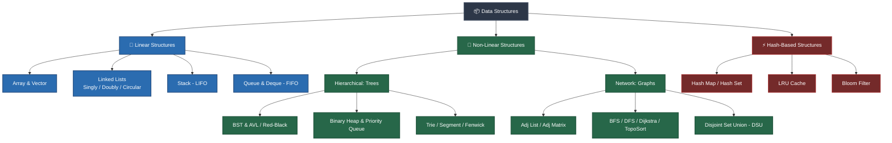
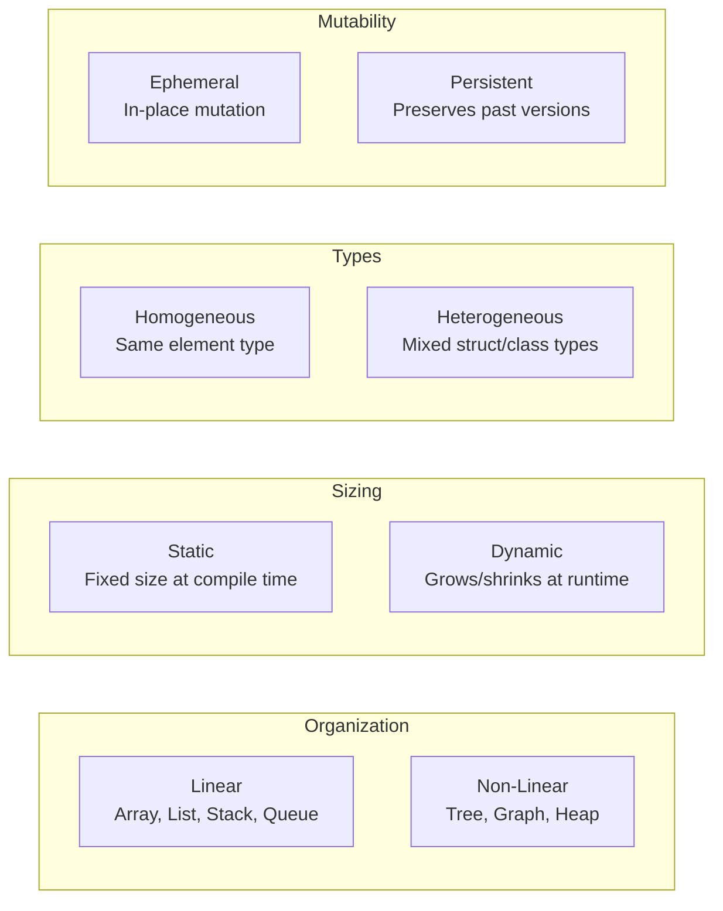
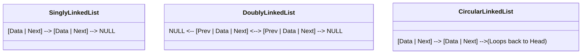
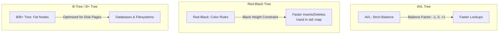
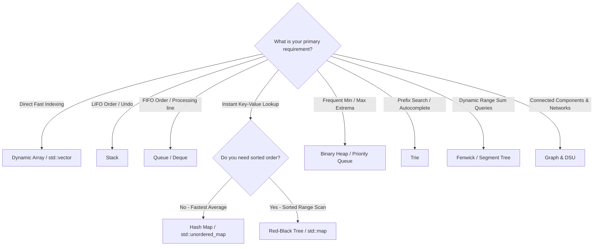

# 🚀 Comprehensive Data Structures & Algorithms Reference Guide
> **An Interactive, Visual, and Concept-Driven Guide for Students & Engineers**  
> *Clear Theory • Visual Diagrams • Time/Space Complexities • Modern C++17 Tested Implementations*

---

<div align="center">

[](https://isocpp.org/)
[](#)
[%20to%20O(N!)-brightgreen?style=for-the-badge)](#-master-complexity-cheatsheet)
[](#-how-to-compile--test)
[](#)

<p align="center">
  <b>Explore fundamental and advanced computer science building blocks with intuitive mental models, ASCII/Mermaid visual representations, decision flows, and production-grade implementations.</b>
</p>

[🧱 Fundamentals](#part-1---fundamentals) •
[📏 Arrays](#part-2---linear-structures-arrays) •
[🔗 Linked Lists](#part-3---linear-structures-linked-lists) •
[🥞 Stacks & Queues](#part-4---linear-structures-stack-queue-deque) •
[⚡ Hash Tables & LRU](#part-5---hash-based-structures) •
[🌳 Trees & Heaps](#part-6---hierarchical-structures-trees) •
[🕸️ Graphs & DSU](#part-7---network-structures-graphs) •
[🧭 Master Cheatsheet](#part-8---choosing-the-right-structure)

</div>

---

## 🗺️ Visual Taxonomy of Data Structures



---

## 📚 Table of Contents

- [Part 1 - Fundamentals & Core Concepts](#part-1---fundamentals)
  - [1.1 What is a Data Structure?](#11-what-is-a-data-structure)
  - [1.2 Abstract Data Type (ADT) vs. Data Structure](#12-abstract-data-type-adt-vs-data-structure)
  - [1.3 Taxonomy & Classification](#13-classification-of-data-structures)
  - [1.4 Complexity Analysis & Big-O Guide](#14-complexity-analysis)
  - [1.5 Memory Architecture (Stack, Heap, Cache Locality)](#15-memory-basics-that-every-structure-builds-on)
- [Part 2 - Linear Structures: Arrays](#part-2---linear-structures-arrays)
  - [2.1 Concept & Memory Addressing Math](#21-array---concept)
  - [2.2 Array Variants & Memory Layouts](#22-variants-of-the-array)
  - [2.3 Mathematical Proof: Why Doubling is Amortized O(1)](#23-why-doubling-gives-amortized-o1)
  - [2.4 Implementation: Dynamic Array (`std::vector` Under the Hood)](#24-implementation-dynamic-array-in-c)
  - [2.5 Essential Array Problem Patterns](#25-common-array-techniques)
- [Part 3 - Linear Structures: Linked Lists](#part-3---linear-structures-linked-lists)
  - [3.1 Concept & Node Architecture](#31-linked-list---concept)
  - [3.2 Types of Linked Lists](#32-types-of-linked-list)
  - [3.3 Comprehensive Comparison: Array vs. Linked List](#33-array-vs-linked-list)
  - [3.4 Implementation: Singly & Doubly Linked Lists](#34-implementation-singly-and-doubly-linked-lists-in-c)
  - [3.5 Essential Linked List Tricks (Floyd's Cycle, Reversal, Sentinels)](#35-linked-list-techniques)
- [Part 4 - Linear Structures: Stack, Queue, Deque](#part-4---linear-structures-stack-queue-deque)
  - [4.1 Stack (LIFO) & Applications](#41-stack-lifo)
  - [4.2 Queue (FIFO) & Circular Array Buffer](#42-queue-fifo)
  - [4.3 Deque (Double-Ended Queue)](#43-deque)
  - [4.4 Implementation: Stack, Circular Queue & Balanced Parentheses](#44-implementation-stack-circularqueue-and-balanced-parentheses)
- [Part 5 - Hash-Based Structures](#part-5---hash-based-structures)
  - [5.1 Hash Table Concept & Hash Functions](#51-hash-table---concept)
  - [5.2 Collision Handling (Chaining vs. Open Addressing)](#52-collision-handling)
  - [5.3 Load Factor $\alpha$ & Dynamic Rehashing](#load-factor-and-rehashing)
  - [5.4 Implementation: Hash Table with Chaining](#53-implementation-hash-table-with-chaining-in-c)
  - [5.5 Case Study: Production LRU Cache ($O(1)$ Get & Put)](#case-study-lru-cache)
- [Part 6 - Hierarchical Structures: Trees](#part-6---hierarchical-structures-trees)
  - [6.1 Tree Terminology & Anatomy](#61-tree-terminology)
  - [6.2 Binary Trees & Shapes (Full, Complete, Perfect, Degenerate)](#62-binary-trees)
  - [6.3 Tree Traversals (DFS vs. BFS)](#tree-traversals)
  - [6.4 Binary Search Tree (BST) & 3 Deletion Cases](#63-binary-search-tree-bst)
  - [6.5 Self-Balancing Trees (AVL, Red-Black, B/B+ Trees)](#64-self-balancing-trees)
  - [6.6 Binary Heap & Priority Queue](#66-heap-and-priority-queue)
  - [6.7 Trie (Prefix Tree)](#67-trie-prefix-tree)
  - [6.8 Range Query Trees: Segment Tree & Fenwick (BIT)](#68-segment-tree-and-fenwick-tree)
- [Part 7 - Network Structures: Graphs](#part-7---network-structures-graphs)
  - [7.1 Graph Terminology & Definitions](#71-graph-terminology)
  - [7.2 Graph Representations (Adj List vs. Adj Matrix)](#72-graph-representations)
  - [7.3 Graph Traversals & Algorithms (BFS, DFS, Dijkstra, TopoSort)](#73-graph-traversal-and-algorithms)
  - [7.4 Disjoint Set Union (DSU / Union-Find) with Path Compression](#74-disjoint-set-union-union-find)
- [Part 8 - Choosing the Right Structure](#part-8---choosing-the-right-structure)
  - [8.1 📊 Master Complexity Cheatsheet](#81-master-complexity-table)
  - [8.2 🧭 Interactive Problem Decision Flowchart](#82-decision-guide)
  - [8.3 ⚠️ 7 Deadly Student Pitfalls & Fixes](#83-common-pitfalls)
  - [8.4 🚀 4-Stage Study Roadmap & Practice Matrix](#84-study-roadmap-and-classic-practice-problems)
- [Appendix - Sorting & Searching at a Glance](#appendix---sorting-and-searching-at-a-glance)
- [🛠️ How to Compile & Run the Code](#-how-to-compile--run)

---

# Part 1 - Fundamentals

> 💡 **Core Idea**: A data structure is a specialized layout for organizing, storing, and manipulating data in memory efficiently.

### 1.1 What is a data structure?
Every software application handles data. But **how** that data sits in physical RAM determines whether an operation takes 1 nanosecond or 10 minutes.

A complete data structure consists of two inseparable parts:
1. **Memory Layout**: How bytes and records are laid out (contiguous blocks vs. scattered nodes with pointers).
2. **Operations & Algorithms**: The set of rules to insert, delete, search, update, and traverse those elements.

---

### 1.2 Abstract Data Type (ADT) vs. Data Structure

Students often confuse the **interface** with the **implementation**. Here is the clean mental model:

| Concept | What is it? | Analogy | Examples |
| :--- | :--- | :--- | :--- |
| **Abstract Data Type (ADT)** | **What** it does (Behavior & Interface). No memory specifics. | A TV Remote control (buttons for volume, channel) | `List`, `Stack`, `Queue`, `PriorityQueue`, `Map`, `Set` |
| **Data Structure** | **How** it is built (Concrete physical memory layout & code). | The electronic circuits inside the TV remote | `Dynamic Array`, `Singly Linked List`, `Binary Min-Heap`, `Red-Black Tree` |

> [!TIP]
> **One ADT can have multiple Data Structure implementations!**  
> For example, the `Queue` ADT can be implemented using a **Circular Array** or a **Doubly Linked List**. Both satisfy FIFO, but with different cache locality and memory overhead.

---

### 1.3 Classification of Data Structures



- **Linear vs. Non-linear**: In a linear structure, elements form a straight sequence (each item has at most 1 predecessor and 1 successor). Non-linear structures branch into hierarchies (trees) or arbitrary interconnected webs (graphs).
- **Static vs. Dynamic**: Static structures (`int arr[100]`) have fixed compile-time capacity. Dynamic structures (`std::vector`, linked nodes) allocate memory from the heap as needed.
- **Homogeneous vs. Heterogeneous**: Homogeneous holds identical types (`std::vector<int>`); heterogeneous holds diverse data fields (`struct Student { string name; int id; };`).
- **Ephemeral vs. Persistent**: Ephemeral overwrites data in-place; persistent structures maintain access to historic versions after modifications (popular in functional programming and Git internals).

---

### 1.4 Complexity Analysis

We quantify the efficiency of data structures using **Asymptotic Big-O Notation**, ignoring hardware clock speeds and low-order constants.

```
Fastest / Best  🟢  O(1)        -> Constant time (Hash lookup, array indexing)
                🟢  O(log n)    -> Logarithmic (Binary search, BST operations)
                🟡  O(n)        -> Linear (Single pass scan, list traversal)
                🟡  O(n log n)  -> Linearithmic (MergeSort, HeapSort, QuickSort avg)
                🔴  O(n²)       -> Quadratic (Nested loops, BubbleSort, naive pairwise)
                🔴  O(2ⁿ)       -> Exponential (Subsets generation, naive Fibonacci)
Slowest / Worst 💀  O(n!)       -> Factorial (Permutations, Traveling Salesperson)
```

#### Best, Average, and Worst Case
- **Best Case ($\Omega$)**: The absolute minimum operations required (e.g., target element is at index `0` in linear search $\rightarrow O(1)$).
- **Average Case ($\Theta$)**: The expected runtime across uniform input distributions (e.g., QuickSort is $O(n \log n)$ average).
- **Worst Case ($O$)**: The guaranteed upper bound for pathological inputs (e.g., QuickSort with worst pivot is $O(n^2)$).

#### Amortized Analysis
When an operation is very fast most of the time but occasionally expensive, we average the total cost over a sequence of $n$ operations:
$$\text{Amortized Cost} = \frac{\text{Total Cost of } n \text{ Operations}}{n}$$
*Example*: Adding an element to `std::vector` is $O(1)$ almost always, except when the buffer fills and triggers an $O(n)$ reallocation. Averaged over all inserts, `push_back` is **amortized $O(1)$**.

> [!IMPORTANT]
> **The $10^8$ Operations Rule of Thumb**:  
> A standard modern CPU executes roughly **$10^8$ basic operations per second**.
> - $n \le 10^5 \implies O(n \log n)$ or $O(n)$ will pass comfortably within 1 second.
> - $n \le 10^3 \implies O(n^2)$ is usually acceptable.
> - $n \le 20 \implies O(2^n)$ or $O(n!)$ backtracking is feasible.

---

### 1.5 Memory Basics That Every Structure Builds On

Understanding RAM is what separates average coders from high-performance software engineers.

```
       CPU CACHE (L1 / L2 / L3)               MAIN RAM (Heap / Stack)
  +--------------------------------+     +--------------------------------+
  | [ 10 ][ 20 ][ 30 ][ 40 ][ 50 ] | <== | Contiguous Block: Fast Cache   |
  +--------------------------------+     +--------------------------------+
           ⚡ Ultra Fast                        
                                         +----+      +----+      +----+
  Cache Miss / Stalled Pipeline    <== | 10 | ---> | 20 | ---> | 30 | (Nodes)
                                         +----+      +----+      +----+
                                         Scattered in Heap: Slow Hopping
```

1. **Contiguous Memory (Arrays)**:
   - Elements sit side-by-side: `Address(A[i]) = Base_Address + i * sizeof(Element)`.
   - **CPU Cache Locality**: Loading `A[0]` fetches an entire 64-byte Cache Line into L1 cache, making sequential access lightning fast!
2. **Linked Memory (Pointers/Nodes)**:
   - Elements live scattered anywhere in the heap. Each node stores the memory address of the next node.
   - Inserting is flexible, but traversing requires pointer chasing, which causes frequent **CPU cache misses**.
3. **Stack vs. Heap**:
   - **Call Stack**: Fast allocation, automated cleanup upon function exit, strictly bounded size (~1MB–8MB).
   - **Heap Memory**: Dynamic runtime allocation via `new` / `malloc`. High capacity, manual lifecycle management (`delete` / `free`).

---

# Part 2 - Linear Structures: Arrays

> 💡 **Core Idea**: The simplest, most cache-friendly data structure. Continuous memory block with $O(1)$ instant random access by index.

### 2.1 Array - Concept

```
 index:    0      1      2      3      4
        +------+------+------+------+------+
 value: |  10  |  20  |  30  |  40  |  50  |
        +------+------+------+------+------+
 addr:   1000   1004   1008   1012   1016      (4-byte integers, Base = 1000)

 Formula: Address = 1000 + (3 * 4) = 1012  ==> a[3] is at 1012
```

- **Pros**: $O(1)$ random access, zero pointer overhead, optimal CPU cache line utilization.
- **Cons**: Fixed capacity (for static arrays), costly $O(n)$ insertions/deletions due to shifting elements.

---

### 2.2 Variants of the Array

| Variant | Characteristics | C++ Standard Library |
| :--- | :--- | :--- |
| **Static Array** | Fixed size allocated at compile time on stack. | `int a[N];` or `std::array<T, N>` |
| **Dynamic Array** | Resizable heap buffer that grows automatically. | `std::vector<T>` |
| **2D / Multi-D Array** | Stored in **row-major order** in C++: `offset = r * cols + c`. | `std::vector<std::vector<T>>` |
| **String** | Dynamic character array with null terminator helper tools. | `std::string` |
| **Bitset** | Packed bit array (1 bit per boolean flag). | `std::bitset<N>`, `std::vector<bool>` |

---

### 2.3 Why Doubling Gives Amortized $O(1)$

When a dynamic array is full, it:
1. Allocates a new heap array of size $2 \times \text{capacity}$.
2. Copies all $n$ items from the old array.
3. Frees the old memory.

#### Mathematical Proof:
Suppose we insert $n$ elements into an array starting with capacity 1. Reallocations happen at sizes: $1, 2, 4, 8, 16, \dots, n$.

$$\text{Total Copy Operations} = 1 + 2 + 4 + 8 + \dots + n = \sum_{i=0}^{\log_2 n} 2^i = 2n - 1 < 2n$$

$$\text{Amortized Cost per Insertion} = \frac{\text{Total Work}}{n} = \frac{O(n) + n \cdot O(1)}{n} = \mathbf{O(1)}$$

> [!WARNING]
> If you grow by a fixed step (e.g., $+10$ slots) instead of multiplying by $2$, the total copies will be $10 + 20 + 30 + \dots + n = O(n^2)$, degrading each insertion to **$O(n)$**!

---

### 2.4 Implementation: Dynamic Array in C++

<details open>
<summary><b>🔍 Click to view / collapse Dynamic Array C++17 Implementation</b></summary>

```cpp
#include <cassert>
#include <cstddef>
#include <iostream>
#include <stdexcept>
#include <utility>

// A custom resizable array replicating std::vector mechanics
template <typename T>
class DynamicArray {
    T* data_;
    std::size_t size_;
    std::size_t cap_;

    void grow(std::size_t newCap) {
        T* fresh = new T[newCap];
        for (std::size_t i = 0; i < size_; ++i) {
            fresh[i] = std::move(data_[i]);
        }
        delete[] data_;
        data_ = fresh;
        cap_ = newCap;
    }

public:
    DynamicArray() : data_(new T[2]), size_(0), cap_(2) {}
    ~DynamicArray() { delete[] data_; }

    // Disable copy for simplicity (Rule of 3/5)
    DynamicArray(const DynamicArray&) = delete;
    DynamicArray& operator=(const DynamicArray&) = delete;

    void push_back(const T& v) {                 // Amortized O(1)
        if (size_ == cap_) grow(cap_ * 2);
        data_[size_++] = v;
    }

    void pop_back() {                            // O(1)
        if (size_ == 0) throw std::out_of_range("Array is empty");
        --size_;
    }

    void insert(std::size_t idx, const T& v) {   // O(n) due to right shift
        if (idx > size_) throw std::out_of_range("Index out of bounds");
        if (size_ == cap_) grow(cap_ * 2);
        for (std::size_t i = size_; i > idx; --i) {
            data_[i] = std::move(data_[i - 1]);
        }
        data_[idx] = v;
        ++size_;
    }

    void erase(std::size_t idx) {                // O(n) due to left shift
        if (idx >= size_) throw std::out_of_range("Index out of bounds");
        for (std::size_t i = idx; i + 1 < size_; ++i) {
            data_[i] = std::move(data_[i + 1]);
        }
        --size_;
    }

    T& operator[](std::size_t i) {               // O(1) random access
        if (i >= size_) throw std::out_of_range("Index out of bounds");
        return data_[i];
    }

    std::size_t size() const { return size_; }
    std::size_t capacity() const { return cap_; }
};

int main() {
    DynamicArray<int> arr;
    for (int i = 1; i <= 5; ++i) arr.push_back(i * 10);  // [10, 20, 30, 40, 50]
    arr.insert(2, 25);                                    // [10, 20, 25, 30, 40, 50]
    arr.erase(0);                                         // [20, 25, 30, 40, 50]
    
    assert(arr.size() == 5 && arr[0] == 20 && arr[1] == 25);
    arr.pop_back();
    assert(arr.size() == 4);
    
    std::cout << "✅ Dynamic Array tests passed successfully!\n";
    return 0;
}
```
</details>

---

### 2.5 Common Array Techniques

```
1. 👈 Two Pointers 👉  : [L] -----------> <----------- [R]  (Two-sum, palindrome, partition)
2. 🪟 Sliding Window   : [==== Window ====] ---->           (Subarray with max sum / distinct items)
3. ➕ Prefix Sums       : pre[r] - pre[l-1] = RangeSum[l..r] (O(1) range sum queries)
4. 🎯 Binary Search     : Cut search space in half each step  (O(log n) on sorted arrays)
```

---

# Part 3 - Linear Structures: Linked Lists

> 💡 **Core Idea**: A sequence of dynamic nodes connected by pointers. Easy $O(1)$ insertion and deletion without shifting, but no direct random access.

### 3.1 Linked List - Concept

```
  head                                          tail
   |                                             |
   v                                             v
 +----+----+     +----+----+     +----+----+     +----+------+
 | 10 |  *--+--->| 20 |  *--+--->| 30 |  *--+--->| 40 | null |
 +----+----+     +----+----+     +----+----+     +----+------+
 (Node: value | next pointer)
```

---

### 3.2 Types of Linked List



- **Singly Linked List**: Traversal in forward direction only. Lightweight (1 pointer per node).
- **Doubly Linked List**: Bidirectional traversal (`prev` & `next`). Enables $O(1)$ node removal when node pointer is given.
- **Circular Linked List**: Tail links back to Head. Useful for round-robin scheduling and buffering.

---

### 3.3 Array vs. Linked List

| Feature | Dynamic Array (`std::vector`) | Linked List (`std::list`) |
| :--- | :--- | :--- |
| **Random Access (`a[i]`)** | ⚡ **$O(1)$ Instant** | 🐢 **$O(n)$ Sequential Traversal** |
| **Insert / Delete at Front** | 🐢 $O(n)$ (Shifting required) | ⚡ **$O(1)$ Instant** |
| **Insert / Delete at End** | ⚡ **Amortized $O(1)$** | ⚡ **$O(1)$ (with Tail pointer)** |
| **Insert / Delete in Middle**| 🐢 $O(n)$ (Shifting) | ⚡ **$O(1)$ (once pointer is known)** |
| **Memory Overhead** | 🟢 **Zero extra overhead** (pure data) | 🔴 **High** (8–16 bytes pointer per node) |
| **CPU Cache Locality** | 🟢 **Exceptional (Contiguous)** | 🔴 **Poor (Scattered heap jumps)** |

---

### 3.4 Implementation: Singly and Doubly Linked Lists in C++

<details open>
<summary><b>🔍 Click to view / collapse Linked Lists C++17 Implementation</b></summary>

```cpp
#include <cassert>
#include <iostream>

// ==========================================
// 1. Singly Linked List
// ==========================================
struct Node {
    int val;
    Node* next;
    explicit Node(int v) : val(v), next(nullptr) {}
};

class SinglyLinkedList {
    Node* head_ = nullptr;
    Node* tail_ = nullptr;
    int size_ = 0;

public:
    ~SinglyLinkedList() {
        while (head_) {
            Node* temp = head_;
            head_ = head_->next;
            delete temp;
        }
    }

    void push_front(int v) {                     // O(1)
        Node* n = new Node(v);
        n->next = head_;
        head_ = n;
        if (!tail_) tail_ = n;
        ++size_;
    }

    void push_back(int v) {                      // O(1) with tail pointer
        Node* n = new Node(v);
        if (tail_) tail_->next = n;
        else head_ = n;
        tail_ = n;
        ++size_;
    }

    bool remove(int v) {                         // O(n) search + unlink
        Node* prev = nullptr;
        for (Node* cur = head_; cur; prev = cur, cur = cur->next) {
            if (cur->val == v) {
                if (prev) prev->next = cur->next;
                else head_ = cur->next;
                if (cur == tail_) tail_ = prev;
                delete cur;
                --size_;
                return true;
            }
        }
        return false;
    }

    void reverse() {                             // O(n) Time, O(1) Space
        Node *prev = nullptr, *cur = head_;
        tail_ = head_;
        while (cur) {
            Node* nextTemp = cur->next;
            cur->next = prev;
            prev = cur;
            cur = nextTemp;
        }
        head_ = prev;
    }

    int size() const { return size_; }
};

// ==========================================
// 2. Doubly Linked List
// ==========================================
class DoublyLinkedList {
    struct DNode {
        int val;
        DNode *prev, *next;
        explicit DNode(int v) : val(v), prev(nullptr), next(nullptr) {}
    };
    DNode *head_ = nullptr, *tail_ = nullptr;

public:
    ~DoublyLinkedList() {
        while (head_) {
            DNode* temp = head_;
            head_ = head_->next;
            delete temp;
        }
    }

    void push_back(int v) {                      // O(1)
        DNode* n = new DNode(v);
        n->prev = tail_;
        if (tail_) tail_->next = n;
        else head_ = n;
        tail_ = n;
    }

    void pop_back() {                            // O(1) - Only possible in Doubly!
        if (!tail_) return;
        DNode* temp = tail_;
        tail_ = tail_->prev;
        if (tail_) tail_->next = nullptr;
        else head_ = nullptr;
        delete temp;
    }
};

int main() {
    SinglyLinkedList s;
    s.push_back(10); s.push_back(20); s.push_front(5); // 5 -> 10 -> 20
    s.reverse();                                       // 20 -> 10 -> 5
    assert(s.size() == 3);
    s.remove(10);                                      // 20 -> 5
    assert(s.size() == 2);

    DoublyLinkedList d;
    d.push_back(100); d.push_back(200);
    d.pop_back();

    std::cout << "✅ Linked List implementations tested successfully!\n";
    return 0;
}
```
</details>

---

### 3.5 Linked List Techniques

```
1. 🛡️ Sentinel / Dummy Head : Prevents edge-case handling for inserting/deleting at head.
2. 🐢 Floyd's Tortoise & Hare: Fast (2 steps) & Slow (1 step) pointers:
    ├── Middle of list detection: Slow reaches middle when Fast hits end.
    └── Cycle Detection: If Fast meets Slow, a loop exists!
3. 🔄 3-Pointer In-Place Reversal: Maintain (prev, curr, next) while flipping pointers backwards.
```

---

# Part 4 - Linear Structures: Stack, Queue, Deque

> 💡 **Core Idea**: Restricted-access collections where insertion and deletion locations are strictly governed.

```
       STACK (LIFO)                             QUEUE (FIFO)
  Last In, First Out                       First In, First Out

        |  Push  |  Pop                           Enqueue               Dequeue
        v        |                                   |                     ^
     +--------------+                                v                     |
     |   Top Item   |                             +---------------------------+
     +--------------+                             | [10] [20] [30] [40] [50]  |
     |  Base Item   |                             +---------------------------+
     +--------------+                                Rear                Front
     (Like a pile of plates)                      (Like a line at a ticket counter)
```

---

### 4.1 Stack (LIFO)
- **Rules**: Elements are added and removed strictly from the **Top**.
- **Operations**: `push(x)` $O(1)$, `pop()` $O(1)$, `top()` $O(1)$.
- **Applications**: Compiler syntax checking, Call stack execution, Undo/Redo mechanisms, Expression evaluation (Infix $\to$ Postfix), Monotonic Stack (Next Greater Element).

---

### 4.2 Queue (FIFO)
- **Rules**: Enqueue at the **Rear**, Dequeue from the **Front**.
- **The Circular Buffer Solution**: In a plain array queue, repeated dequeues leave wasted empty space at the front. A **Circular Queue** wraps pointers using modulo arithmetic:
  $$\text{Next Slot} = (\text{rear} + 1) \pmod{\text{Capacity}}$$
- **Applications**: Breadth-First Search (BFS), Printer spooling, CPU task scheduling, Network packet buffering.

---

### 4.3 Deque (Double-Ended Queue)
- Supports `push_front`, `push_back`, `pop_front`, `pop_back` all in **$O(1)$** time.
- **Top Technique**: Monotonic Deque for solving the classic **Sliding Window Maximum** in $O(n)$ linear time!

---

### 4.4 Implementation: Stack, CircularQueue, and Balanced Parentheses

<details open>
<summary><b>🔍 Click to view / collapse Stack, Queue & Bracket Matching Code</b></summary>

```cpp
#include <cassert>
#include <iostream>
#include <stdexcept>
#include <string>

// 1. Stack using Linked Nodes (Never overflows)
template <typename T>
class Stack {
    struct Node { T val; Node* next; };
    Node* top_ = nullptr;
    int size_ = 0;

public:
    ~Stack() { while (!empty()) pop(); }
    void push(const T& v) { top_ = new Node{v, top_}; ++size_; }
    void pop() {
        if (!top_) throw std::underflow_error("Stack is empty");
        Node* t = top_;
        top_ = top_->next;
        delete t;
        --size_;
    }
    T& top() {
        if (!top_) throw std::underflow_error("Stack is empty");
        return top_->val;
    }
    bool empty() const { return top_ == nullptr; }
    int size() const { return size_; }
};

// 2. Circular Queue using Fixed-Size Array
class CircularQueue {
    int* buf_;
    int cap_, head_ = 0, count_ = 0;

public:
    explicit CircularQueue(int capacity) : buf_(new int[capacity]), cap_(capacity) {}
    ~CircularQueue() { delete[] buf_; }

    bool enqueue(int v) {                        // O(1)
        if (count_ == cap_) return false;        // Queue full
        buf_[(head_ + count_) % cap_] = v;
        ++count_;
        return true;
    }

    bool dequeue(int& out) {                     // O(1)
        if (count_ == 0) return false;           // Queue empty
        out = buf_[head_];
        head_ = (head_ + 1) % cap_;
        --count_;
        return true;
    }

    bool full() const { return count_ == cap_; }
    bool empty() const { return count_ == 0; }
};

// 3. Classic Stack Application: Balanced Bracket Checker
bool isBalanced(const std::string& s) {
    Stack<char> st;
    for (char c : s) {
        if (c == '(' || c == '[' || c == '{') st.push(c);
        else if (c == ')' || c == ']' || c == '}') {
            if (st.empty()) return false;
            char open = st.top(); st.pop();
            if ((c == ')' && open != '(') ||
                (c == ']' && open != '[') ||
                (c == '}' && open != '{')) return false;
        }
    }
    return st.empty();
}

int main() {
    Stack<int> st;
    st.push(10); st.push(20);
    assert(st.top() == 20);
    st.pop();
    assert(st.top() == 10);

    CircularQueue q(3);
    q.enqueue(1); q.enqueue(2); q.enqueue(3);
    assert(q.full());
    int val;
    q.dequeue(val);
    assert(val == 1);
    q.enqueue(4);                                // Wraps around seamlessly

    assert(isBalanced("{[()]}"));
    assert(!isBalanced("([)]"));
    std::cout << "✅ Stack, Circular Queue, and Bracket Checker OK!\n";
    return 0;
}
```
</details>

---

# Part 5 - Hash-Based Structures

> 💡 **Core Idea**: Transform any key into an integer array index using a hash function, achieving average **$O(1)$** lookup, insertion, and deletion.

### 5.1 Hash Table - Concept

```
  Key: "alice"  ───► Hash Function: h("alice") = 8342917 ───►  Index = 8342917 % 5 = 2

  Bucket Array:
  [0] : null
  [1] : [ "bob" : 25 ] ──► null
  [2] : [ "alice" : 30 ] ──► [ "dave" : 41 ] ──► null    <-- Collision Chained!
  [3] : null
  [4] : [ "carol" : 19 ] ──► null
```

#### Criteria for a Good Hash Function:
- **Deterministic**: Same input always generates identical hash.
- **Uniform Distribution**: Distributes keys evenly across all available buckets.
- **Fast Execution**: Computes in $O(1)$ or $O(L)$ where $L$ is key byte length.

---

### 5.2 Collision Handling

Since the key space is infinite and table slots are finite, collisions ($\text{hash}(k_1) = \text{hash}(k_2)$) are mathematically inevitable (Pigeonhole Principle).

| Strategy | Mechanism | Pros | Cons |
| :--- | :--- | :--- | :--- |
| **Separate Chaining** | Each bucket is a linked list or dynamic vector of entries. | Simple, handles high load factors gracefully. | Extra pointer memory, poor cache locality. |
| **Open Addressing: Linear Probing** | If slot is taken, probe sequentially: `(idx + 1) % size`. | Superior CPU cache line locality. | **Primary Clustering** (long cluster chains form). |
| **Open Addressing: Quadratic Probing** | Probe with quadratic jumps: `(idx + i²) % size`. | Reduces primary clustering. | Secondary clustering. |
| **Double Hashing** | Step size given by a second hash: `(idx + i * h₂(key)) % size`. | Eliminates clustering completely. | Extra hash calculation cost. |

---

### Load Factor and Rehashing

$$\text{Load Factor } (\alpha) = \frac{\text{Number of Stored Elements } (n)}{\text{Total Number of Buckets } (k)}$$

- When $\alpha > 0.75$, collisions spike exponentially.
- **Rehashing**: Allocate a bucket array of $2 \times \text{size}$, recompute hashes for all entries, and migrate them. Amortized cost per insertion remains **$O(1)$**.

---

### 5.3 Implementation: Hash Table with Chaining in C++

<details open>
<summary><b>🔍 Click to view / collapse Hash Table C++17 Implementation</b></summary>

```cpp
#include <cassert>
#include <functional>
#include <iostream>
#include <list>
#include <string>
#include <utility>
#include <vector>

template <typename K, typename V>
class HashTable {
    using Entry = std::pair<K, V>;
    std::vector<std::list<Entry>> buckets_;
    std::size_t count_ = 0;

    std::size_t getIndex(const K& key) const {
        return std::hash<K>{}(key) % buckets_.size();
    }

    void rehash(std::size_t newCap) {
        std::vector<std::list<Entry>> fresh(newCap);
        for (auto& chain : buckets_) {
            for (auto& entry : chain) {
                std::size_t newIdx = std::hash<K>{}(entry.first) % newCap;
                fresh[newIdx].push_back(std::move(entry));
            }
        }
        buckets_ = std::move(fresh);
    }

public:
    explicit HashTable(std::size_t initCap = 8) : buckets_(initCap) {}

    void put(const K& key, const V& val) {       // Average O(1)
        auto& chain = buckets_[getIndex(key)];
        for (auto& entry : chain) {
            if (entry.first == key) {
                entry.second = val;              // Overwrite existing key
                return;
            }
        }
        if ((count_ + 1) > buckets_.size() * 3 / 4) { // Rehash if load factor > 0.75
            rehash(buckets_.size() * 2);
        }
        buckets_[getIndex(key)].emplace_back(key, val);
        ++count_;
    }

    V* get(const K& key) {                       // Average O(1)
        auto& chain = buckets_[getIndex(key)];
        for (auto& entry : chain) {
            if (entry.first == key) return &entry.second;
        }
        return nullptr;
    }

    bool erase(const K& key) {                   // Average O(1)
        auto& chain = buckets_[getIndex(key)];
        for (auto it = chain.begin(); it != chain.end(); ++it) {
            if (it->first == key) {
                chain.erase(it);
                --count_;
                return true;
            }
        }
        return false;
    }

    std::size_t size() const { return count_; }
};

int main() {
    HashTable<std::string, int> map;
    map.put("Apple", 5);
    map.put("Banana", 8);
    map.put("Apple", 10); // Update
    assert(*map.get("Apple") == 10);
    assert(map.get("Orange") == nullptr);
    assert(map.erase("Banana"));
    assert(map.size() == 1);
    std::cout << "✅ Hash Table tests passed!\n";
    return 0;
}
```
</details>

---

### Case Study: LRU Cache

> 🎯 **Problem**: Design a Cache that supports `get(key)` and `put(key, value)` in **$O(1)$ Time**, evicting the **Least Recently Used** item when capacity is exceeded.

```
       HASH MAP (O(1) Access)            DOUBLY LINKED LIST (O(1) Reordering)
  +--------------------------------+   +---------------------------------------+
  | Key 1 ──► [Pointer to Node A]  |   | [MRU: A] <--> [B] <--> [LRU: C]       |
  | Key 2 ──► [Pointer to Node B]  |   +---------------------------------------+
  | Key 3 ──► [Pointer to Node C]  |        ^                             ^
  +--------------------------------+        |                             |
                                        Most Recent                  Evict on Full
```

<details open>
<summary><b>🔍 Click to view / collapse LRU Cache C++17 Implementation</b></summary>

```cpp
#include <cassert>
#include <iostream>
#include <list>
#include <unordered_map>
#include <utility>

class LRUCache {
    int cap_;
    std::list<std::pair<int, int>> dll_; // Front = MRU, Back = LRU
    std::unordered_map<int, std::list<std::pair<int, int>>::iterator> map_;

public:
    explicit LRUCache(int capacity) : cap_(capacity) {}

    int get(int key) {                           // O(1)
        auto it = map_.find(key);
        if (it == map_.end()) return -1;
        dll_.splice(dll_.begin(), dll_, it->second); // Move node to front (MRU)
        return it->second->second;
    }

    void put(int key, int value) {               // O(1)
        auto it = map_.find(key);
        if (it != map_.end()) {
            it->second->second = value;
            dll_.splice(dll_.begin(), dll_, it->second);
            return;
        }
        if (static_cast<int>(dll_.size()) == cap_) { // Evict LRU from back
            int lruKey = dll_.back().first;
            dll_.pop_back();
            map_.erase(lruKey);
        }
        dll_.emplace_front(key, value);
        map_[key] = dll_.begin();
    }
};

int main() {
    LRUCache cache(2);
    cache.put(1, 100);
    cache.put(2, 200);
    assert(cache.get(1) == 100);                 // Key 1 becomes MRU
    cache.put(3, 300);                           // Evicts Key 2 (LRU)
    assert(cache.get(2) == -1);                  // Key 2 was evicted
    assert(cache.get(3) == 300);
    std::cout << "✅ LRU Cache tests passed!\n";
    return 0;
}
```
</details>

---

# Part 6 - Hierarchical Structures: Trees

> 💡 **Core Idea**: Non-linear hierarchical model consisting of nodes connected by edges, with a single Root node and strictly **no cycles**.

### 6.1 Tree Terminology

```
              (10)            <-- Root (Level 0, Depth 0)
             /    \
           (5)    (15)        <-- Subtrees / Internal Nodes
          /   \      \
        (2)   (7)    (20)     <-- Leaves (No children, Depth 2)
```

- **Depth of a Node**: Number of edges from Root down to the node.
- **Height of a Tree**: Number of edges on the longest path from Root to a Leaf.
- **Edges Count**: A tree with $n$ nodes always has exactly **$n - 1$ edges**.

---

### 6.2 Binary Trees

A tree where every node has **at most 2 children** (`left` and `right`).

```
  Full Tree              Complete Tree            Perfect Tree          Degenerate (Skewed)
   (Every node has        (All levels filled       (All leaves same       (Behaves like a
    0 or 2 kids)           except last, from L)     depth, 2^(h+1)-1)      linked list - O(N))
       (1)                    (1)                      (1)                   (1)
      /   \                  /   \                    /   \                    \
    (2)   (3)              (2)   (3)                (2)   (3)                  (2)
          / \              /                        / \   / \                    \
        (4) (5)          (4)                      (4)(5) (6)(7)                  (3)
```

---

### Tree Traversals

| Traversal | Order Rule | Primary Use Case | Output for BST (Fig 6.2) |
| :--- | :--- | :--- | :--- |
| **In-Order (DFS)** | `Left` $\to$ `Node` $\to$ `Right` | **Prints BST keys in sorted ascending order!** | `20, 30, 40, 50, 60, 70, 80` |
| **Pre-Order (DFS)** | `Node` $\to$ `Left` $\to$ `Right` | Tree cloning, prefix expression evaluation. | `50, 30, 20, 40, 70, 60, 80` |
| **Post-Order (DFS)**| `Left` $\to$ `Right` $\to$ `Node` | Tree deletion (freeing memory), bottom-up DP. | `20, 40, 30, 60, 80, 70, 50` |
| **Level-Order (BFS)**| Breadth-first level by level | Shortest path, hierarchical printing. | `50, 30, 70, 20, 40, 60, 80` |

---

### 6.3 Binary Search Tree (BST)

**The BST Invariant**: For every node $X$:
$$\text{Keys}(\text{Left Subtree}) < \text{Key}(X) < \text{Keys}(\text{Right Subtree})$$

#### Deleting a Node - The 3 Cases:
1. **Node is a Leaf**: Simply delete it.
2. **Node has 1 Child**: Bypass the node, connecting its parent directly to its child.
3. **Node has 2 Children**: Find the **In-Order Successor** (smallest key in Right subtree), copy its value into the current node, then delete the successor.

<details open>
<summary><b>🔍 Click to view / collapse BST C++17 Implementation</b></summary>

```cpp
#include <algorithm>
#include <cassert>
#include <iostream>
#include <queue>

struct TreeNode {
    int key;
    TreeNode *left = nullptr, *right = nullptr;
    explicit TreeNode(int k) : key(k) {}
};

class BST {
    TreeNode* root_ = nullptr;

    TreeNode* insert(TreeNode* n, int k) {
        if (!n) return new TreeNode(k);
        if (k < n->key) n->left = insert(n->left, k);
        else if (k > n->key) n->right = insert(n->right, k);
        return n;
    }

    TreeNode* minNode(TreeNode* n) {
        while (n && n->left) n = n->left;
        return n;
    }

    TreeNode* remove(TreeNode* n, int k) {
        if (!n) return nullptr;
        if (k < n->key) n->left = remove(n->left, k);
        else if (k > n->key) n->right = remove(n->right, k);
        else {
            if (!n->left) { TreeNode* r = n->right; delete n; return r; }
            if (!n->right) { TreeNode* l = n->left; delete n; return l; }
            TreeNode* succ = minNode(n->right);
            n->key = succ->key;
            n->right = remove(n->right, succ->key);
        }
        return n;
    }

    void destroy(TreeNode* n) {
        if (!n) return;
        destroy(n->left); destroy(n->right); delete n;
    }

public:
    ~BST() { destroy(root_); }
    void insert(int k) { root_ = insert(root_, k); }
    void remove(int k) { root_ = remove(root_, k); }

    bool search(int k) const {                   // O(h) Time
        TreeNode* cur = root_;
        while (cur) {
            if (k == cur->key) return true;
            cur = (k < cur->key) ? cur->left : cur->right;
        }
        return false;
    }
};

int main() {
    BST tree;
    tree.insert(50); tree.insert(30); tree.insert(70);
    assert(tree.search(30));
    tree.remove(30);
    assert(!tree.search(30));
    std::cout << "✅ BST tests passed!\n";
    return 0;
}
```
</details>

---

### 6.4 Self-Balancing Trees

Plain BSTs can degenerate to $O(n)$ chains on sorted inputs. Self-balancing trees guarantee $O(\log n)$ height.



#### Comparison of Search Trees:
| Tree Type | Height Bound | Rebalancing Cost | Primary Ideal Use Case |
| :--- | :--- | :--- | :--- |
| **Plain BST** | $O(n)$ worst case | None | Unsorted randomized insertions |
| **AVL Tree** | $\le 1.44 \log_2 n$ | Rotations on insert & delete | Lookup-heavy read databases |
| **Red-Black Tree** | $\le 2 \log_2(n + 1)$ | Fewer rotations than AVL | General purpose (`std::map`, `std::set`) |
| **B+ Tree** | Very shallow ($O(\log_B n)$) | Node splits & merges | Database indexes (MySQL, PostgreSQL, NTFS) |

---

### 6.6 Heap and Priority Queue

A **Binary Min-Heap** is a complete binary tree where every parent $\le$ its children.
Because it is a complete tree, it fits into a flat array without pointers!

```
 Tree View:                    Array Index Mapping Math:
         (1)                   -------------------------
       /     \                 Parent(i)      = (i - 1) / 2
     (3)     (2)               Left Child(i)  = 2*i + 1
    /   \   /                  Right Child(i) = 2*i + 2
  (7)   (4)(5)
 Array: [ 1,  3,  2,  7,  4,  5 ]
 idx:     0   1   2   3   4   5
```

<details open>
<summary><b>🔍 Click to view / collapse Min-Heap C++17 Implementation</b></summary>

```cpp
#include <cassert>
#include <iostream>
#include <stdexcept>
#include <utility>
#include <vector>

class MinHeap {
    std::vector<int> a_;

    void siftUp(std::size_t i) {
        while (i > 0) {
            std::size_t p = (i - 1) / 2;
            if (a_[p] <= a_[i]) break;
            std::swap(a_[p], a_[i]);
            i = p;
        }
    }

    void siftDown(std::size_t i) {
        for (;;) {
            std::size_t l = 2 * i + 1, r = 2 * i + 2, sm = i;
            if (l < a_.size() && a_[l] < a_[sm]) sm = l;
            if (r < a_.size() && a_[r] < a_[sm]) sm = r;
            if (sm == i) break;
            std::swap(a_[i], a_[sm]);
            i = sm;
        }
    }

public:
    void push(int v) {                           // O(log n)
        a_.push_back(v);
        siftUp(a_.size() - 1);
    }

    int top() const {                            // O(1)
        if (a_.empty()) throw std::underflow_error("Heap is empty");
        return a_.front();
    }

    void pop() {                                 // O(log n)
        if (a_.empty()) throw std::underflow_error("Heap is empty");
        a_.front() = a_.back();
        a_.pop_back();
        if (!a_.empty()) siftDown(0);
    }

    bool empty() const { return a_.empty(); }
};

int main() {
    MinHeap h;
    for (int x : {5, 3, 8, 1, 9, 2}) h.push(x);
    assert(h.top() == 1);
    h.pop();
    assert(h.top() == 2);
    std::cout << "✅ Binary Heap tests passed!\n";
    return 0;
}
```
</details>

---

### 6.7 Trie (Prefix Tree)

Stores strings by common prefixes. Every operation takes **$O(L)$ time**, where $L$ is the word length (independent of the total number of words in the dictionary!).

```
 words: "cat", "car", "care", "dog"
         (Root)
         /    \
       [c]    [d]
        |      |
       [a]    [o]
       / \     |
     (t) (r)  (g)*
          |
         (e)*     * = isEndOfWord flag
```

---

### 6.8 Segment Tree & Fenwick Tree (Range Queries)

| Data Structure | Range Sum Query | Point Update | Build Time | Space Overhead |
| :--- | :--- | :--- | :--- | :--- |
| **Naive Array** | $O(n)$ | $O(1)$ | $O(n)$ | $O(n)$ |
| **Prefix Sum Array** | $O(1)$ | $O(n)$ | $O(n)$ | $O(n)$ |
| **Fenwick Tree (BIT)** | ⚡ **$O(\log n)$** | ⚡ **$O(\log n)$** | $O(n)$ | 🟢 **$O(n)$ minimal** |
| **Segment Tree** | ⚡ **$O(\log n)$** | ⚡ **$O(\log n)$** | $O(n)$ | 🟡 **$O(4n)$ nodes** |

---

# Part 7 - Network Structures: Graphs

> 💡 **Core Idea**: A mathematical set $G = (V, E)$ of vertices (nodes) and edges (connections). Generalizes trees by permitting cycles and disconnected components.

### 7.1 Graph Terminology

```
 Undirected Graph                    Directed Acyclic Graph (DAG)
      (0)-----(1)                               (0) ───► (1)
       |  \    |                                 │        │
       |   \   |                                 ▼        ▼
      (2)   \ (3)                               (2) ───► (3)
```

- **Degree**: Number of edges incident to a vertex (In-degree vs. Out-degree in directed graphs).
- **Connected Components**: Isolated subgraphs where every vertex can reach every other vertex.
- **Cycle**: A path that starts and ends at the same vertex with no repeated edges.

---

### 7.2 Graph Representations

| Feature | Adjacency List `vector<vector<int>>` | Adjacency Matrix `int M[V][V]` |
| :--- | :--- | :--- |
| **Memory Space** | 🟢 **$O(V + E)$ (Optimal for Sparse)** | 🔴 **$O(V^2)$ (Heavy)** |
| **Edge Existence Query `(u, v)`** | 🟡 $O(\text{deg}(u))$ | ⚡ **$O(1)$ Instant** |
| **Iterate All Neighbors of $u$** | ⚡ **$O(\text{deg}(u))$ Instant** | 🐢 $O(V)$ (Scans entire row) |
| **Ideal When** | Most real-world graphs ($E \ll V^2$) | Dense graphs ($E \approx V^2$) |

---

### 7.3 Graph Traversal and Algorithms

```
 Traversal / Algorithm   Data Structure   Time Complexity     Best Used For
 ---------------------   --------------   ---------------     -------------
 Breadth-First (BFS)     Queue (FIFO)     O(V + E)            Shortest path on unweighted graphs
 Depth-First (DFS)       Stack / Recursion O(V + E)           Cycle detection, Topological sort, Backtracking
 Dijkstra's Algorithm    Min-PriorityQueue O((V + E) log V)   Shortest path with non-negative weights
 Kahn's Algorithm        In-Degree Queue  O(V + E)            Topological ordering of build dependencies
```

<details open>
<summary><b>🔍 Click to view / collapse Graph Algorithms Implementation</b></summary>

```cpp
#include <cassert>
#include <functional>
#include <iostream>
#include <limits>
#include <queue>
#include <vector>

class Graph {
    int n_;
    bool directed_;
    std::vector<std::vector<std::pair<int, int>>> adj_; // u -> {v, weight}

public:
    Graph(int n, bool directed) : n_(n), directed_(directed), adj_(n) {}

    void addEdge(int u, int v, int w = 1) {
        adj_[u].push_back({v, w});
        if (!directed_) adj_[v].push_back({u, w});
    }

    // Shortest Path using Dijkstra: O((V + E) log V)
    std::vector<long long> dijkstra(int src) const {
        const long long INF = std::numeric_limits<long long>::max();
        std::vector<long long> dist(n_, INF);
        using P = std::pair<long long, int>;
        std::priority_queue<P, std::vector<P>, std::greater<P>> pq;

        dist[src] = 0;
        pq.push({0, src});

        while (!pq.empty()) {
            auto [d, u] = pq.top(); pq.pop();
            if (d > dist[u]) continue; // Stale heap entry
            for (auto [v, w] : adj_[u]) {
                if (dist[u] + w < dist[v]) {
                    dist[v] = dist[u] + w;
                    pq.push({dist[v], v});
                }
            }
        }
        return dist;
    }
};

int main() {
    Graph g(4, false);
    g.addEdge(0, 1, 4);
    g.addEdge(0, 2, 1);
    g.addEdge(2, 1, 2);
    g.addEdge(1, 3, 1);

    auto dist = g.dijkstra(0);
    assert(dist[3] == 4); // Path: 0 -> 2 -> 1 -> 3 (1 + 2 + 1 = 4)
    std::cout << "✅ Dijkstra Graph tests passed!\n";
    return 0;
}
```
</details>

---

### 7.4 Disjoint Set Union (Union-Find)

Manages partitioning of elements into disjoint sets with two critical speed optimizations:
1. **Path Compression**: Flattens the tree during `find(x)`, pointing every node directly to root.
2. **Union by Size / Rank**: Merges smaller tree under larger tree.

$$\text{Time Complexity per Operation} = \mathbf{O(\alpha(n))} \approx \mathbf{O(1)} \quad (\alpha \text{ is Inverse Ackermann } \le 4)$$

```cpp
class DSU {
    std::vector<int> parent_, size_;
public:
    explicit DSU(int n) : parent_(n), size_(n, 1) {
        for (int i = 0; i < n; ++i) parent_[i] = i;
    }
    int find(int x) {
        if (parent_[x] != x) parent_[x] = find(parent_[x]); // Path compression
        return parent_[x];
    }
    bool unite(int a, int b) {
        a = find(a); b = find(b);
        if (a == b) return false;
        if (size_[a] < size_[b]) std::swap(a, b);
        parent_[b] = a;
        size_[a] += size_[b];
        return true;
    }
};
```

---

# Part 8 - Choosing the Right Structure

### 8.1 Master Complexity Table

| Data Structure | Access by Index | Search by Value | Insertion | Deletion | Space Complexity |
| :--- | :---: | :---: | :---: | :---: | :---: |
| **Static Array** | $O(1)$ | $O(n)$ | N/A | N/A | $O(n)$ |
| **Dynamic Array (`std::vector`)** | $O(1)$ | $O(n)$ | $O(1)^*$ at end / $O(n)$ mid | $O(1)$ at end / $O(n)$ mid | $O(n)$ |
| **Singly Linked List** | $O(n)$ | $O(n)$ | $O(1)$ at head / $O(n)$ mid | $O(1)$ at head / $O(n)$ mid | $O(n)$ |
| **Doubly Linked List** | $O(n)$ | $O(n)$ | $O(1)$ at ends / $O(1)$ given ptr | $O(1)$ at ends / $O(1)$ given ptr | $O(n)$ |
| **Stack / Queue** | $O(n)$ | $O(n)$ | $O(1)$ | $O(1)$ | $O(n)$ |
| **Hash Table (`std::unordered_map`)** | N/A | **$O(1)$ avg** / $O(n)$ worst | **$O(1)^*$ avg** / $O(n)$ worst | **$O(1)$ avg** / $O(n)$ worst | $O(n)$ |
| **Balanced BST (`std::map`, AVL)** | N/A | **$O(\log n)$** | **$O(\log n)$** | **$O(\log n)$** | $O(n)$ |
| **Binary Heap (`std::priority_queue`)** | N/A | $O(n)$ / $O(1)$ for min/max | **$O(\log n)$** | **$O(\log n)$** | $O(n)$ |
| **Trie (Prefix Tree)** | N/A | **$O(L)$** | **$O(L)$** | **$O(L)$** | $O(\Sigma \cdot N \cdot L)$ |
| **Segment Tree / Fenwick** | N/A | **$O(\log n)$ Range Query**| **$O(\log n)$** Point Update | N/A | $O(n)$ |
| **Graph (Adj List)** | N/A | $O(V + E)$ Traversal | $O(1)$ Add Edge | $O(E)$ Remove Edge | $O(V + E)$ |

*\* Denotes amortized time.*

---

### 8.2 Decision Guide



---

### 8.3 Common Pitfalls

> [!CAUTION]
> 1. **Dangling Pointers & Leaks**: For every `new`, ensure an exact matching `delete`. Use AddressSanitizer (`-fsanitize=address`) in tests.
> 2. **Iterator Invalidation**: Inserting into a `std::vector` can reallocate memory and invalidate existing pointers and iterators.
> 3. **Unchecked Nullptr**: Always check `if (!node)` before accessing `node->next` or `node->left`.
> 4. **Stack Overflow in Recursion**: Deep recursion on a degenerate tree with $10^5$ nodes will crash the call stack. Use an iterative traversal with an explicit stack.
> 5. **Integer Overflow**: Edge weights and cumulative prefix sums can easily exceed $2^{31}-1$. Always use `long long`.

---

### 8.4 Study Roadmap and Classic Practice Problems

| Stage | Focus Topics | Classic LeetCode & Practice Problems |
| :--- | :--- | :--- |
| **Stage 1: Linear Core** | Dynamic Arrays, Strings, Two Pointers, Linked Lists | Two Sum, Best Time to Buy/Sell Stock, Reverse Linked List, Linked List Cycle |
| **Stage 2: Stacks, Queues, Hash** | Monotonic Stack, Sliding Window, Collision Resolution | Valid Parentheses, Daily Temperatures, Sliding Window Maximum, LRU Cache |
| **Stage 3: Trees & Heaps** | BSTs, AVL, HeapSort, PriorityQueues | Invert Binary Tree, Validate BST, Kth Largest Element, Merge K Sorted Lists |
| **Stage 4: Graphs & Advanced** | BFS, DFS, Dijkstra, DSU, Segment Tree | Number of Islands, Course Schedule, Network Delay Time, Redundant Connection |

---

# Appendix - Sorting and Searching at a Glance

| Algorithm | Best Time | Average Time | Worst Time | Space | Stable? | Key Insight |
| :--- | :---: | :---: | :---: | :---: | :---: | :--- |
| **QuickSort** | $O(n \log n)$ | $O(n \log n)$ | $O(n^2)$ | $O(\log n)$ | ❌ No | In-place partition; cache friendly |
| **MergeSort** | $O(n \log n)$ | $O(n \log n)$ | $O(n \log n)$ | $O(n)$ | ✅ Yes | Guaranteed $O(n \log n)$; ideal for lists |
| **HeapSort** | $O(n \log n)$ | $O(n \log n)$ | $O(n \log n)$ | $O(1)$ | ❌ No | In-place guaranteed $O(n \log n)$ |
| **InsertionSort** | $O(n)$ | $O(n^2)$ | $O(n^2)$ | $O(1)$ | ✅ Yes | Fast for tiny or nearly-sorted arrays |
| **Binary Search** | $O(1)$ | $O(\log n)$ | $O(\log n)$ | $O(1)$ | N/A | Requires sorted contiguous collection |

---

## 🛠️ How to Compile & Run

All implementations in this guide are written in standard **C++17** and tested with memory sanitizers:

```bash
# Compile with AddressSanitizer and full warnings
g++ -std=c++17 -Wall -Wextra -fsanitize=address -O2 main.cpp -o app

# Run binary
./app
```

---

<div align="center">
  <sub>Authored with ❤️ for Students and Software Engineers. Star ⭐ this repository if it helped your learning journey!</sub>
</div>
